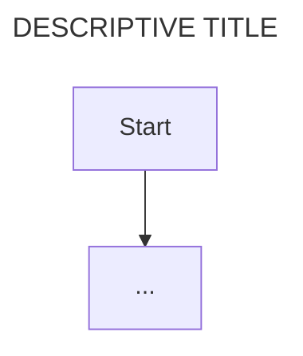

# [SERVICE NAME] Architecture

This document contains the architectural design of the service with the focus on internal components and how they interact. Use of the names and their appropriate technologies are required.

**service directory**

- path/to/service

// describe the service's purpose, responsibilities, and position within the larger system

## Service Overview

**Technology Stack**

- [Framework/Runtime]: description
- [Database/Storage]: description
- [Key Libraries]: description

**External Dependencies**

- [Service/API 1]: description of dependency
- [Service/API 2]: description of dependency

**API Surface**

- [Endpoint/Interface 1]: description
- [Endpoint/Interface 2]: description

## Internal Components

Describes the definitions and use of each internal component, its technology, and the scope of its responsibilities within the service.

## Service components

**[Component Name]** (e.g., Controller Layer, Business Logic, Data Access)

// description of component and its role within the service

**Core Functionality: [Component Name]**

- [Functionality 1]: functionality description
- [Functionality 2]: functionality description
- [Functionality 3]: functionality description

**Architecture Diagram of component: [Component Name]**

**[Component Name]**

// description of component and its role within the service

**Core Functionality: [Component Name]**

- [Functionality 1]: functionality description
- [Functionality 2]: functionality description
- [Functionality 3]: functionality description

**Architecture Diagram of component: [Component Name]**

## Service Integration Points

**Inbound Communication**

// describe how other services/clients communicate with this service

**Outbound Communication**

// describe how this service communicates with other services/external APIs
