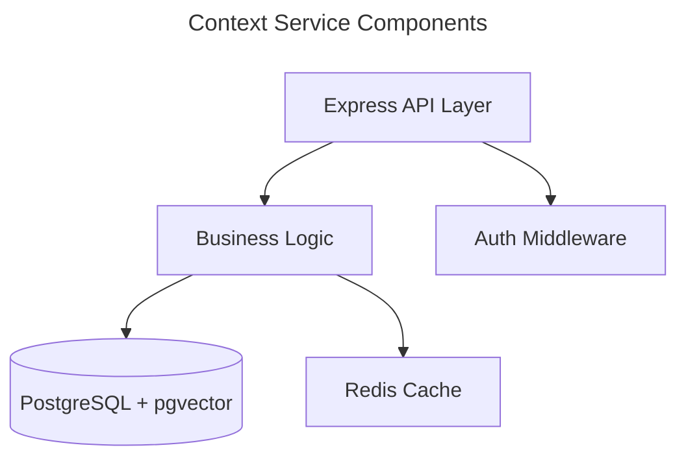

# Manage Architecture Docs Reference

## Classification Rules (Detail)

### Project Architecture (`docs/designs/architecture/architecture.md`)

The project-level architecture doc provides a high-level view of the entire system — its components, technologies, and how they interact.

**Context to gather for create:**
- `CLAUDE.md` — project overview, architecture diagram, key patterns
- `docs/designs/c4-context-diagram.md`, `docs/designs/c4-container-diagram.md` — C4 diagrams
- Existing service architecture docs in `docs/designs/architecture/` — component summaries
- `src/docker-compose.yml` — service topology, ports, dependencies
- `docs/designs/*.md` — design docs for cross-cutting concerns

**Context to gather for update:**
- Run `detect-changes.sh` scoped to `docs/designs/` and `src/`
- Focus on new/removed services, changed C4 diagrams, changed design docs

### Service Architecture (`docs/designs/architecture/<service>-architecture.md`)

Service-level architecture docs detail a single service's internal components, technology stack, external dependencies, API surface, and integration points.

**Context to gather for create:**
- `src/<service>/package.json` — dependencies, scripts, name
- `src/<service>/.env.example` — environment variables (reveals external dependencies)
- `src/<service>/src/` — code structure, entry point, route definitions, middleware
- `src/<service>/tsconfig.json` — TypeScript configuration
- `src/<service>/Dockerfile` (if present) — container configuration
- `docs/designs/<service>.md` (if present) — existing design doc for the service

**Context to gather for update:**
- Run `detect-changes.sh` scoped to `src/<service>/`
- Focus on changed routes, new dependencies, structural refactors, new integration points

## Section Anatomy

### Project architecture sections (from template)

| Section | Content source | Update trigger |
|---------|---------------|----------------|
| High-level component definitions | CLAUDE.md, C4 diagrams | Architecture changes |
| System components | Service architecture docs | New services, major refactors |
| Component Mermaid diagrams | Code structure, dependencies | Structural changes |

### Service architecture sections (from template)

| Section | Content source | Update trigger |
|---------|---------------|----------------|
| Service Overview | `package.json`, entry point | Service purpose changes |
| Technology Stack | `package.json` dependencies | Dependency changes |
| External Dependencies | `.env.example`, imports | New integrations |
| API Surface | Route definitions | Route changes |
| Internal Components | Code structure, layers | Structural refactors |
| Component Mermaid diagrams | Code analysis | Component changes |
| Service Integration Points | Imports, config, event handlers | Integration changes |

## Mermaid Diagramming Conventions

Architecture docs use Mermaid `flowchart TD` (top-down) diagrams. Follow these conventions:

1. **Title every diagram** using the `---\ntitle: ...\n---` frontmatter syntax
2. **Use descriptive node labels** — `[Service Name]` not `[A]`
3. **Show data flow direction** — arrows indicate communication direction
4. **Group related nodes** with subgraphs when a component has sub-components
5. **Keep diagrams focused** — one diagram per component, not one giant diagram

Example:

## Service Name Resolution

When the user provides a service name instead of a full path, resolve it:

1. Check if `src/<name>/` exists — if so, use it
2. Check if `src/<name>-svc/` exists — try with `-svc` suffix
3. If neither exists, list available services under `src/` and ask the user

The output path is always `docs/designs/architecture/<service>-architecture.md`.

## Existing Architecture Docs

The project already has architecture docs at `docs/designs/architecture/`:
- `architecture.md` — project-level
- `agent-proxy-svc-architecture.md`, `aurora-ai-architecture.md`, `cc-svc-architecture.md`, `clickhouse-mcp-architecture.md`, `content-moderation-mcp-architecture.md`, `ctx-svc-architecture.md`, `evt-svc-architecture.md`, `frontend-architecture.md`, `github-issues-mcp-architecture.md`

When creating a new service architecture doc, check this list first — the doc may already exist.
