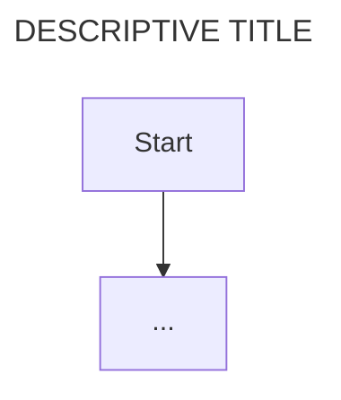

## [SERVICE NAME]

Note: make the use_case.md created is specific to the service code being documented. For example the auth should flow the type of auth implemented in the service. Each use-case should be specific to the service implementation.

**service directory**

- path/to/service

// describe the service defined in the above path. Include:
// - Service purpose and responsibilities
// - Key technologies/frameworks used
// - Dependencies on other services
// - API endpoints/interfaces exposed

## USE-CASE: [USE CASE TITLE i.e. validate user token]

**Feature 1: [FEATURE DESCRIPTION]**

|| definition |
|--|--|
| GIVEN ||
| WHEN ||
| THEN ||

**State Diagram: Logic flow within feature**

// short description of the stateDiagram below

```mermaid
---
title: [DESCRIPTIVE TITLE]
---
stateDiagram-v2
    [*] -->

```

**Sequence Diagram: Interactions between service components/external services**

// short description of the flow chart below



**Data Entity Relationship: Data structure for entities in Feature**

// short description of data structures below

```mermaid
---
title: [DESCRIPTIVE TITLE]
---
erDiagram
...

```
