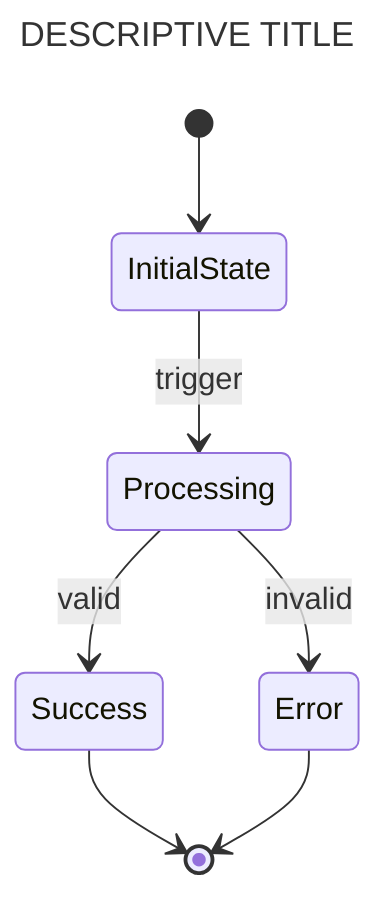
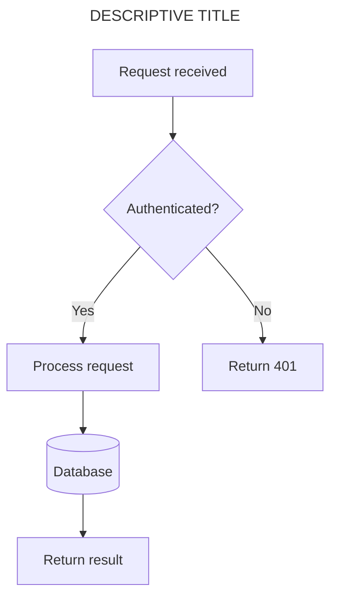
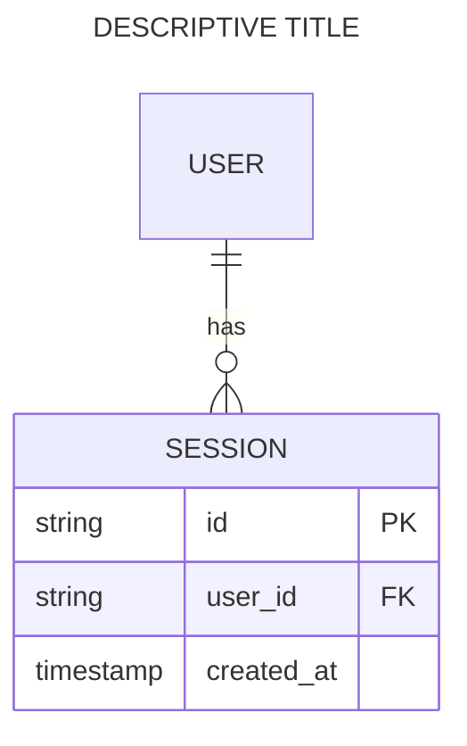

# Manage Use-Cases Docs Reference

## Classification Rules (Detail)

### Project Use-Cases (`docs/designs/use-cases/use_cases.md`)

The project-level use-cases doc provides a high-level view of the system's key user-facing scenarios across all services.

**Context to gather for create:**
- `CLAUDE.md` — project overview, architecture, key patterns
- Existing service use-cases docs in `docs/designs/use-cases/` — feature summaries
- `docs/designs/*.md` — design docs for cross-cutting concerns (auth, messaging, etc.)
- `src/docker-compose.yml` — service topology, dependencies

**Context to gather for update:**
- Run `detect-changes.sh` scoped to `docs/designs/` and `src/`
- Focus on new/removed services, changed design docs, changed service use-cases docs

### Service Use-Cases (`docs/designs/use-cases/<service>-use-cases.md`)

Service-level use-cases docs detail the specific features and workflows implemented by a single service — derived directly from the code.

**Context to gather for create:**
- `src/<service>/package.json` — dependencies, scripts, name
- `src/<service>/.env.example` — environment variables (reveals integrations)
- `src/<service>/src/` — code structure, entry point, route definitions, handlers, middleware
- `src/<service>/tsconfig.json` — TypeScript configuration
- `docs/designs/<service>.md` (if present) — existing design doc for the service

**Context to gather for update:**
- Run `detect-changes.sh` scoped to `src/<service>/`
- Focus on changed routes, new handlers, new event listeners, changed business logic

## Section Anatomy

### Project use-cases sections (from template)

| Section | Content source | Update trigger |
|---------|---------------|----------------|
| Project description | CLAUDE.md, design docs | Architecture changes |
| Project directories | Service listing | New/removed services |
| Use-cases | Service use-cases docs, design docs | New features, major changes |

### Service use-cases sections (from template)

| Section | Content source | Update trigger |
|---------|---------------|----------------|
| Service description | `package.json`, entry point | Service purpose changes |
| Service directory | Service path | Rarely changes |
| Use-cases | Route definitions, handlers, business logic | Route/handler changes |
| Feature tables | API endpoints, event handlers | New endpoints, changed logic |
| Mermaid diagrams | Code flow analysis | Structural changes |

## Given/When/Then Format

Each feature within a use-case uses a structured table:

```markdown
**Feature 1: [FEATURE DESCRIPTION]**

|| definition |
|--|--|
| GIVEN | [precondition — system state before the action] |
| WHEN | [action — what the user/system does] |
| THEN | [outcome — expected result] |
```

Guidelines:
- GIVEN describes the precondition or initial state
- WHEN describes the specific action or trigger
- THEN describes the observable outcome
- Use implementation-specific details, not generic descriptions
- Reference actual API endpoints, event names, database tables

## Mermaid Diagramming Conventions

Use-case docs use three types of Mermaid diagrams per feature:

### 1. State Diagram — Logic flow within a feature



Guidelines:
- Use `stateDiagram-v2` syntax
- Show decision points and state transitions
- Include error/fallback states
- Keep focused on a single feature's logic

### 2. Sequence/Flowchart — Interactions between systems



Guidelines:
- Use `flowchart TD` (top-down) syntax
- Show interactions between services, components, and external systems
- Include decision points with `{}`
- Use appropriate node shapes: `[]` process, `{}` decision, `[()]` database, `((circle))`

### 3. ER Diagram — Data structures



Guidelines:
- Show entity relationships relevant to the feature
- Include key fields (PK, FK, important attributes)
- Use proper cardinality notation

## Service Name Resolution

When the user provides a service name instead of a full path, resolve it:

1. Check if `src/<name>/` exists — if so, use it
2. Check if `src/<name>-svc/` exists — try with `-svc` suffix
3. If neither exists, list available services under `src/` and ask the user

The output path is always `docs/designs/use-cases/<service>-use-cases.md`.

## Existing Use-Cases Docs

The project already has use-cases docs at `docs/designs/use-cases/`:
- `use_cases.md` — project-level
- `agent-proxy-svc-use-cases.md`, `aurora-ai-use-cases.md`, `cc-svc-use_cases.md`, `clickhouse-mcp-use-cases.md`, `content-moderation-mcp-use-cases.md`, `ctx-svc-use-cases.md`, `evt-svc-use-cases.md`, `frontend-use-cases.md`, `github-issues-mcp-use-cases.md`

When creating a new service use-cases doc, check this list first — the doc may already exist.

## Writing Style

- Write use-cases from the implementation perspective, not abstract requirements
- Use active voice and present tense
- Reference actual code constructs (route paths, event names, function names)
- Be specific about data flow and transformations
- Include error cases and edge cases as separate features within a use-case
