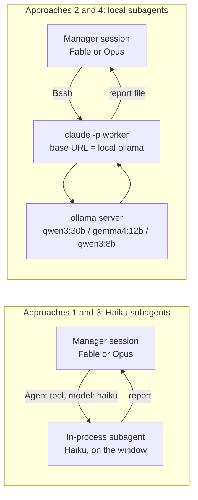

# Hypothesis 1 - strong manager, cheap subagents

Date: 2026-09-07 (rewritten same day after review)
Status: draft - hypotheses stated, nothing measured yet
Problem: [problem-statement.md](problem-statement.md)
Next: [hypothesis_2.md](hypothesis_2.md)

## The hypothesis, as originally stated

> We can use smaller open source models for the swarm approach while retaining
> a stronger model (like Opus/Fable) as the manager/supervisor to retain higher
> level thinking and quality in the outputs.

## The original queries

1. What increase in token availability would you hypothesize?
2. What reduction in output quality do you hypothesize happening between e.g.
   Fable spawning multiple processes (like 25 to 50 subagents for a full scale
   analysis) and Opus (like 5 to 10 subagents)?
3. What would the comparative state be between using the best available local
   models considering the limitations of the current machine, and having
   Fable/Opus use Haiku for their subagents, as compared to larger Anthropic
   models, in terms of both token usage and overall output quality?

Clarification agreed in review: query 2 is **not** Fable versus Opus. It is the
same manager's output quality with **Anthropic subagents** versus **local-model
subagents**. Fable and Opus are both tested as managers so the answer does not
depend on which one is available.

## What we are testing

Two things vary. Nothing else does.

| Variable | Values |
|---|---|
| Manager | Fable, Opus |
| Subagent engine | Haiku (Anthropic, on the window), local ollama models (off the window) |

Every approach is capped per run: **15 subagents under a Fable manager, 5
under an Opus manager**. The caps keep a run inside one 5-hour window and keep
the Opus runs cheap enough to repeat. The 25-50 agent fan-out that started this
is the problem, not a baseline; it is never run.

## Approaches

| ID | Manager | Subagents | Mechanism | Cap |
|---|---|---|---|---|
| 1 | Fable | Haiku | In-process Claude Code subagents with `model: haiku` (agent definition frontmatter, or the Agent tool's `model` parameter) | 15 |
| 2 | Fable | Local via ollama | Manager launches worker `claude -p` processes from Bash. Each worker's environment points the Anthropic base URL at the ollama server already running on this machine, and names one of the models already pulled. The worker is the Claude Code harness in bare mode on a local engine | 15 |
| 3 | Opus | Haiku | As approach 1 | 5 |
| 4 | Opus | Local via ollama | As approach 2 | 5 |

Approaches 1 and 3 are the **Haiku** approaches; 2 and 4 are the **local**
approaches. Nothing new is installed for the local approaches. The ollama server is already running with
qwen3:30b, gemma4:12b and qwen3:8b pulled. No proxy, no second harness.

### Why the two mechanisms differ

An in-process subagent (approaches 1 and 3) shares the manager session's connection, so it can
change *model* but not *where the requests go*. To send a subagent to ollama
the requests have to leave the session, and the simplest way to do that with
the Claude Code harness intact is a child `claude -p` process with its own
environment. That child is still Claude Code. It reads the same rules and
skills, uses the same tools, and writes its report to a file the manager then
reads.



Worker launch shape for the local approaches, verified 2026-09-07 (see the verification log
below for why every flag is there):

```bash
echo "<brief>" | ANTHROPIC_BASE_URL=http://localhost:11434 ANTHROPIC_AUTH_TOKEN=ollama ANTHROPIC_API_KEY="" \
  claude -p --bare --strict-mcp-config --tools Bash Edit Read --model qwen3:30b \
  --output-format json > reports/worker-01.json
```

`--bare` is not optional. Without it the worker carries the full system prompt,
skill listing and memory index (about 32k tokens), which fills the local
model's default 32k context before the brief arrives. With it the worker starts
at under 1k tokens. The cost is that `--bare` also skips hooks, plugins and the
project rules, so **any rule the worker must hold has to travel in the brief**.

### What the cap means per approach

| Approach | Cap | What it means in practice |
|---|---|---|
| 1 | 15 | 15 parallel Haiku subagents. Cloud handles the parallelism |
| 2 | 15 | 15 worker processes, **launched in sequence or in small batches**, not all at once. The daemon runs one request at a time, so a wide launch only adds memory pressure (measured below under "Concurrency") |
| 3 | 5 | 5 parallel Haiku subagents |
| 4 | 5 | 5 local worker processes, sequential or in batches of 2-3 |

Haiku and local approaches have the same *count* per manager but different
*wall-clock*. That is a measured result, not a flaw in the design.

## We think this

### Core claim

Most of a fan-out's tokens go on **mechanical** work (find, read, summarise,
tabulate) that a weaker model does acceptably. Most of the **quality** comes
from the manager's briefing and synthesis. If both hold, subagents can move to
Haiku or to local models with a small quality cost, and the manager keeps most
of the window.

Everything below is a prediction to be tested.

### Query 1 - token usage

The question here is narrow: **how many window tokens does the manager save by
moving its subagents from Haiku to free local models?** Haiku is the cheapest
Anthropic subagent, so this is the smallest saving the local route can show.
Hypothesis 2 will widen the comparison to Sonnet subagents and to bigger local
models that run slower because they are only partly resident in memory.

Two numbers are recorded per run: the tokens the **subagents** consume, and the
tokens the **manager** consumes briefing them and reading their reports.

| Approach | Subagent tokens on the window | Manager tokens on the window | Predicted saving vs the Haiku approach with the same manager |
|---|---|---|---|
| 1 (Fable + Haiku) | All 15 subagents' tokens, weighted at Haiku | Briefs + read-back | baseline |
| 2 (Fable + local) | None | Briefs + read-back + **re-verification** of weaker reports | 60-85% of the pair's window cost |
| 3 (Opus + Haiku) | All 5 subagents' tokens, weighted at Haiku | Briefs + read-back | baseline |
| 4 (Opus + local) | None | Briefs + read-back + re-verification | 60-85% |

Reasoning:

- The window is **cost-weighted by model** (verified, see unknown 3). Anthropic's
  help centre states Opus costs several times more per turn than Sonnet, and
  Sonnet more than Haiku. So Haiku subagents are already the cheap end of the
  Anthropic range, and the local saving is measured against that cheap end.
- The saving is not 100% because the manager pays more with local subagents:
  the brief must carry the rules (bare mode drops them), and the manager must
  re-check reports that a Haiku subagent would have got right. That extra
  manager spend is predicted at 15-40% of what the Haiku subagents would have
  cost.
- Fable and Opus managers should show the same *ratio*. The Opus pair (3 vs 4)
  is the cheap place to measure it; the Fable pair confirms it at width 15.
- Measured in the verification log: a bare local worker starts at under 1k
  tokens of fixed prompt against about 32k for a full-prompt worker. Whatever
  the local subagents consume is off the window entirely, so their token count
  is recorded for wall-clock reasoning only.

### Query 2 - quality: Anthropic subagents vs local subagents, same manager

Prediction per dimension, at 15 subagents, manager held constant:

| Dimension | Haiku subagents (1, 3) | Local subagents (2, 4) | Predicted gap |
|---|---|---|---|
| Depth | Good on mechanical tasks. Misses inference across files | Medium on mechanical tasks. Weaker on anything needing several files held at once | 10-25%, favours Haiku |
| Standards | Follows a rule it was handed | Drifts unless the rule is restated in the brief and the output shape is fixed | Largest gap. 20-40% unless the brief is tightened |
| Alignment | Stays on brief | Drifts on ambiguous briefs | Small if briefs are tight, otherwise 10-20% |
| Effectivity | Manager property. Haiku rarely defers | Manager property. Local workers **defer and oversimplify** more, and fabricate file paths | Small at the manager's output, *if* the manager re-verifies |

Overall prediction: **Haiku subagents beat local subagents by 10-25% on raw
subagent output**, but the gap at the **manager's final output** shrinks to
**0-10%** because the manager is briefing and re-checking either way. Where the
local approaches lose badly it will be on standards, and the fix is a tighter
brief, not a bigger model.

Fable versus Opus as manager: predicted **close**. Fable a few percent ahead on
effectivity and on catching worker mistakes. Not enough to matter for the
hypothesis. Opus is the cheaper manager to run the experiment with.

### Query 3 - local vs Haiku vs larger Anthropic subagents

Machine: Apple M3 Pro, 36 GB unified memory. Local candidates already pulled:

| Model | On disk | Why | Predicted concurrent workers |
|---|---|---|---|
| qwen3:30b (mixture-of-experts, ~3B active) | 18 GB | Best local quality. MoE makes it fast for its size | 1-2, short contexts |
| gemma4:12b | 7.6 GB | Middle tier | 2-3 |
| qwen3:8b | 5.2 GB | Proven driving MCP tools end to end | 3-4 |

Measured after the fact: the "predicted concurrent workers" column was wrong for
all three. The daemon serves **one request at a time** on its defaults, so the
real figure is 1 for every model until the daemon is reconfigured (see
"Concurrency" in the verification log).

| Aspect | Local (2, 4) | Haiku (1, 3) | Larger Anthropic (today, reference only) |
|---|---|---|---|
| Window usage | None | Low, model-weighted | High. One wide run empties the window |
| Money | None | Subscription | Subscription |
| Wall-clock at the cap | **Worst.** The server queues what does not fit, so 15 workers take several rounds | Fast | Fast |
| Tool-call reliability | Acceptable on qwen3, degrades on long tool chains | Good | Best |
| Context headroom | Tight. The Claude Code system prompt alone is a large slice of what fits in memory per worker | 200k | 1M on newer families |
| Depth on mechanical tasks | Medium | Good | Best |
| Standards | Weak unless restated | Good | Best |
| Failure mode | Deferment, oversimplification, fabricated paths | Occasional oversimplification | Rare |
| Setup | One env prefix plus `--bare` on the launch command. Rules travel in the brief | One frontmatter line | None |

Predicted ranking for mechanical tasks: larger Anthropic ≈ Haiku > qwen3:30b >
gemma4:12b > qwen3:8b, with the local gap small enough that manager
re-verification closes it.

Judgment tasks (choose the fix, weigh trade-offs) are **not** given to
subagents in either approach. That is manager work.

The surprise we expect: **the local approaches' binding constraint is
wall-clock, not quality.** Fifteen local workers on a laptop run in rounds, and
a task that Haiku fans out in five minutes may take thirty locally. That makes
Haiku the likely everyday default and local the route for when the window is
already gone or the fan-out is narrow.

### ELI5 - why a weaker subagent can still be fine

A senior engineer asking five juniors to each list every place a function is
called does not need the juniors to be senior. They need them to be accurate
and to say "I couldn't find it" rather than guess. The senior decides what to
do with the lists. The quality of the *decision* comes from the senior. The
risk is a junior who invents a result, which is why the senior spot-checks.
Same shape here: the manager writes the brief, the subagent executes, the
manager spot-checks and decides.

## We will test using this

### Order of work

1. **Verify the unknowns** (below). Two of them could have invalidated the local
   approaches before any run; both passed on 2026-09-07.
2. **Approach 4 first, then 2.** Local runs cost nothing from the window, so
   they shake out the launcher and the briefs for free.
3. **Approach 3, then 1.** One approach per fresh window so runs do not
   contaminate each other's usage reading. Approach 3 at cap 5 is the cheap
   live read of Haiku's weight on the window.

### Benchmark tasks

Same repo state for every run. Core tasks run under all four approaches;
stretch tasks only if the window allows.

| Task | Set | Type | Why it is in the set |
|---|---|---|---|
| T1 - Map every caller of a chosen function across a mid-sized service, tabulate file and line | Core | Mechanical, wide | Pure fan-out. Where local workers either hold up or queue |
| T2 - Audit a service against one rules file, list every violation with file and line | Core | Mechanical with standards | Tests whether a subagent holds a rule it was handed. Predicted weakest point for the local approaches |
| T5 - "What would it take to add feature X" across the codebase, decomposed into up to the cap's worth of subtasks | Core | Mixed | The realistic full-scale analysis under the cap |
| T3 - Given a bug report, find root cause and propose the fix | Stretch | Judgment | Subagents gather, manager decides. Exposes deferment and oversimplification |
| T4 - Summarise 15-20 docs into a decision table | Stretch | Mechanical, long context | Tests context headroom on local models |

### Measurements

| Measure | How |
|---|---|
| Window consumed | Usage indicator before and after each run. One approach per fresh window |
| Wall-clock | Start to final manager answer, per run |
| Subagent count and queueing | Launcher log for the local approaches, agent count for the Haiku approaches |
| Quality, four dimensions | 1-5 per dimension, graded blind by an **independent** Fable session that sees the task and the outputs but not which approach produced them. Same habit as verifying changes in a separate session |
| Failure modes | Tally per run: fabricated paths, deferment, oversimplification, direction change, rule breach |

Result = quality score per unit of window consumed, with wall-clock as the
secondary axis. Target shape: the local approach at 90% of the Haiku approach's
quality while saving most of the pair's window cost.

### Unknowns to settle before the first run

Ordered by how much they change the plan. All five were settled or measured
the same day; details in the verification log.

1. **Does ollama 0.33 serve the Anthropic-shaped messages route?** Claude Code
   only speaks that route. **Verified: yes.** A direct call to `/v1/messages`
   with `qwen3:8b` returned a genuine Anthropic-shaped body. No proxy needed.
2. **Does a child `claude -p` accept a base URL override while the parent
   session stays on subscription auth?** **Verified: yes.** Workers ran on
   qwen3:8b and qwen3:30b from inside a Fable session, which carried on
   unaffected.
3. **Is the window cost-weighted by model?** **Verified: yes.** Anthropic's help
   centre article "Models, usage, and limits in Claude Code" states that Opus
   costs several times more per turn than Sonnet, and Sonnet more than Haiku,
   with no exact multipliers published. So Haiku subagents do save window
   relative to Opus or Fable subagents, and approach 3 is the place to measure
   how much.
4. **How many concurrent ollama requests fit in 36 GB, and does queueing
   behind them time out or error?** **Measured, and the answer reshapes the
   local approaches.** The daemon on its defaults runs **one slot**: every
   request is serialised regardless of how many workers are launched. Queued
   workers did not error or time out in 36 minutes, but launching 15 at once
   pushed the machine into heavy swap and slowed the single slot down. See
   "Concurrency" in the verification log.
5. **Does the Claude Code system prompt fit a local model's context with room
   left for the task?** **Verified: only in bare mode.** The full prompt is
   about 32k tokens against a 32k default context; `--bare` brings it under 1k.

### Verification log - 2026-09-07

All runs: child `claude -p` launched from a Fable session, base URL pointed at
the local ollama server, `--strict-mcp-config`, single-worker, no parallelism.

| Run | Model | Flags | Brief | Input tokens | Wall-clock | Outcome |
|---|---|---|---|---|---|---|
| 1 | qwen3:8b | default (not bare) | "reply PINEAPPLE" | 32,772 | 3m16s | **Failed.** Rambled about a Confluence MCP tool. Context was full before the brief |
| 2 | qwen3:8b | `--bare` | "reply PINEAPPLE" | 576 | 1m12s | Correct |
| 3 | qwen3:8b | `--bare --tools Read Glob Grep` | list .md files with Glob | 1,212 | 1m58s | Said it had no Glob tool. **It was right** - see finding 2 |
| 4 | qwen3:30b | `--bare --tools Read Glob Grep` | same | 597 | 1m29s | **Failed.** 2,389 output tokens of thinking, then an answer of "-" |
| 5 | qwen3:8b | `--bare --tools Bash` | `ls` the folder, list .md files, invent nothing | 2,812 | 1m39s | Correct. Real Bash call, real file names |
| 6 | qwen3:30b | `--bare --tools Bash` | same | 2,453 | 1m50s | Correct |

#### Concurrency - what the local server can actually run at once

Test on 2026-09-07: N bare workers launched simultaneously against the daemon,
each doing the same two-turn Bash task that took a single worker 99s. The
daemon was on its defaults (plain `ollama serve`, no environment variables).

| Batch | Model | Outcome | Wall-clock | Per-worker |
|---|---|---|---|---|
| 1 worker (from the earlier runs) | qwen3:8b | Correct | 99s | 99s |
| 5 at once | qwen3:8b | **All 5 correct, no errors** | 436s total | 389-436s each |
| 15 at once | qwen3:8b | **Cancelled at 36 min with 0 of 15 finished.** No errors, no timeouts, all 15 still connected and queued | - | - |
| 5 at once | qwen3:30b | Not run (cancelled to spare the machine) | - | - |

What the runner reported while the 15-worker batch was stuck:

| Fact | Value |
|---|---|
| Runner slots | **1** (the daemon's default parallelism on this machine). Requests are strictly serialised |
| Worker connections | All 15 established and waiting. None dropped by the client in 36 minutes |
| Swap | 7.4 GB of 8 GB used, ~50 MB RAM unused, 13-14 GB in the compressor |
| llama-server CPU | ~50%, so the one slot was stalling on memory, not computing flat out |
| Worker processes | 16 x ~106 MB = 1.7 GB in total. Not the memory problem |
| Other residents | The model at 9.8 GB, a 5 GB virtual machine, the usual desktop apps |

Reading the numbers:

- The 5-worker batch finishing "together" at ~400s was not parallelism. One
  slot interleaved each worker's two turns, so every worker waited on the
  others and they all completed near the end. Throughput was the same as
  running them one after another (about 87s per worker).
- With 15 workers the queue itself held, but the machine was already near its
  memory ceiling before the test started. Adding 15 processes tipped it into
  heavy swap, which throttled the single slot far below its solo speed.
- The client side is not the weak point. No worker errored or timed out while
  queued for over half an hour.

Consequences for the local approaches:

1. **Launch local workers sequentially or in batches of 2-3.** Launching the
   whole cap at once buys nothing on a one-slot daemon and costs memory.
   A 15-worker run at ~90-100s per worker is 25 minutes of wall-clock, which is
   the figure to plan around.
2. **Concurrency needs a daemon change to exist at all.** `OLLAMA_NUM_PARALLEL`
   raised to 2-4 on restart would give real parallel slots, at the cost of a
   larger key-value cache per slot. With 36 GB shared with a 5 GB VM and the
   desktop, 2 slots on qwen3:8b is the realistic ceiling to try. That is a
   daemon restart, so it is Wikus's call.
3. **Check memory headroom before a local run.** The test started with the
   machine already at ~35 GB used. Closing the VM or the browser before a
   fan-out would matter more than any model choice.
4. **Local is a throughput story, not a correctness story.** Every worker that
   finished was correct. The question local has to answer is whether 25
   minutes of free wall-clock beats 5 minutes of Haiku on the window, and that
   depends on how full the window is.

#### Context ceilings of the local models

Checked with `ollama show` on 2026-09-07. The daemon is a plain `ollama serve`
started by hand, running on defaults, and loads every model with a **32,768
token context** regardless of what the model supports.

| Model | Max context the model supports | Context the daemon loads it with | Fits the full Claude Code prompt (~32.5k) plus a task? |
|---|---|---|---|
| qwen3:8b | 40,960 | 32,768 | No today. Yes in principle at 40k, with ~8k left for the task. Tight |
| gemma4:12b | 262,144 | 32,768 | No today. Yes if the daemon's context length is raised |
| qwen3:30b | 262,144 | 32,768 | No today. Yes if the daemon's context length is raised |

Raising the loaded context means restarting the daemon with
`OLLAMA_CONTEXT_LENGTH` set (for example 65536). A larger context costs memory
for the key-value cache on every loaded model, which cuts the concurrency
measured below. The daemon is Wikus's long-running process, so this is his call
and has not been changed.

Decision this supports: **run local workers in bare mode at the current 32k
context** rather than raise the context to fit the full prompt. Bare mode
starts a worker under 1k tokens, leaves nearly the whole window for the task,
keeps concurrency, and the full prompt was never the right shape for a local
worker anyway - most of it is skill and tool listings the worker does not need.
The only thing lost is the project rules, which travel in the brief instead.

Findings that change the plan:

1. **Bare mode is mandatory for the local approaches.** Run 1 versus run 2 is a 57x difference in
   fixed prompt cost, and run 1 was over the local context limit.
2. **This Claude Code build has no Glob or Grep tool.** Not in bare mode, not
   in the full tool list either. File search is done through Bash. Briefs for
   local workers must say so explicitly, or the worker correctly reports it
   cannot do the task. Run 3 looked like the predicted deferment failure mode
   and was not one.
3. **Bare mode offers Bash, Edit and Read by default.** `--tools` can narrow
   that. For gathering tasks, `--tools Bash Read` is enough.
4. **Local wall-clock is 1-2 minutes per worker turn even for trivial briefs**
   on this machine, including model load and prompt processing. Fifteen
   sequential workers is 15-30 minutes before batching; batching is bounded by
   memory (unknown 4).
5. **qwen3:30b can think itself into an empty answer** (run 4). Briefs should
   fix the output shape and the manager must treat an empty report as a retry,
   not a result.
6. **Bare mode does not pick up subscription login.** A bare child without the
   ollama env prefix reports "not logged in". Irrelevant for the local
   approaches, which always set the prefix, but it rules out using bare
   children for Haiku workers. Approaches 1 and 3 stay in-process.
7. **Rules do not reach a bare worker.** Standards adherence in the local
   approaches therefore depends entirely on what the brief carries. This
   sharpens the query 2 prediction: the local standards gap is a briefing
   problem by construction.

Nothing in the local approaches sends subscription traffic anywhere but Anthropic: the manager
talks to Anthropic as normal, the workers talk only to the local machine. If a
proxy ever becomes necessary, that is the point to check with the AI
Engineering team first.

### Guardrails

- No new software. ollama and Claude Code are already installed.
- Local only. The ollama server stays bound to the machine.
- Any token or key lives in a gitignored `.env`. This repo is public.
- Every subagent output lands as a file so re-verification and blind grading
  are cheap.
- Never more than 15 subagents in a run under Fable, never more than 5 under
  Opus.

## Expected outcome

| If the results show | Then |
|---|---|
| Local saves most of the pair's window cost at near-Haiku quality under both managers | Local subagents become the default for mechanical fan-outs. Haiku for time-sensitive work |
| Local saves window but the manager's re-verification eats most of it back | Tighten briefs and output shapes first; if the saving stays under 30%, Haiku is the default and local is the empty-window fallback |
| Local fails T2 (standards) but passes T1 and T5 | Split the brief: local subagents gather, one Haiku or manager pass applies the rules |
| Local wall-clock at cap 15 is unacceptable | Local for narrow fan-outs and empty windows only. Haiku for wide |
| Fable and Opus managers score within a few percent | Run Opus as manager by default and keep Fable for judgment-heavy work |

Next document: `results_1.md`, once the first approach 4 run on T1, T2 and T5
is recorded.
