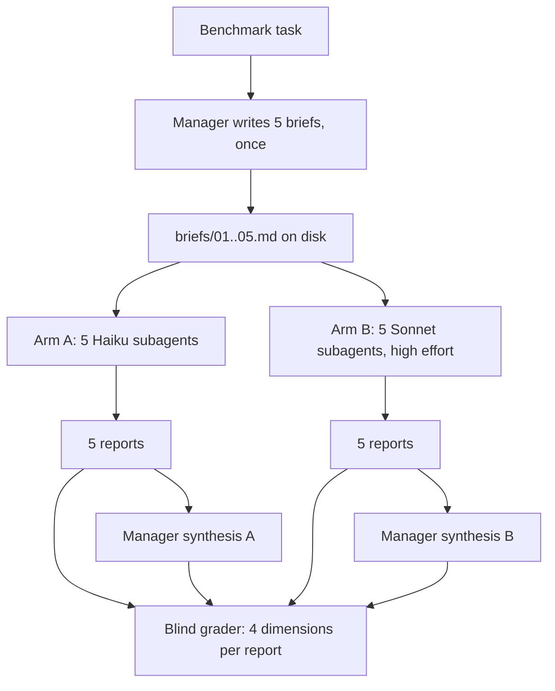

# Hypothesis 2 - a swarm does not need clever subagents

Date: 2026-09-09
Status: **run once, 2026-09-10.** Results: [results_2.md](results_2.md)
Problem: [problem-statement.md](problem-statement.md)
Previous: [hypothesis_1.md](hypothesis_1.md)
Spun off: [hypothesis_3.md](hypothesis_3.md) - verification as its own tier
Extended by: [hypothesis_2_1.md](hypothesis_2_1.md) - the same briefs run on local models

## The hypothesis, as originally stated

> Using a swarm does not necessarily mean using complex models for each
> subagent, and we likely can get away with smaller models here.

The test proposed alongside it:

> Two mini swarms. Five Haiku subagents investigating a topic versus five
> Sonnet subagents investigating the same topic. Both starting from scratch,
> using the same base prompt, with the Sonnet subagents set to high effort.
> See what differs in quality.

## How this differs from hypothesis 1

[Hypothesis 1](hypothesis_1.md) asked whether subagent work can leave the
subscription window entirely, by running on local models. It found the local
route works and is correct, but that the machine serialises it, so a wide local
fan-out is slow rather than parallel.

Hypothesis 2 stays inside the window and asks a narrower question: **among
Anthropic models, how far down can the subagent tier go before quality
drops?** Nothing here is local. Nothing here needs the daemon or a child
process.

| | Hypothesis 1 | Hypothesis 2 |
|---|---|---|
| Subagent engine | Local (ollama) vs Haiku | Haiku vs Sonnet |
| Runs on the window | Only the manager | Everything |
| Main cost measured | Window tokens saved | Window tokens saved |
| Main risk measured | Wall-clock and correctness | Quality per dimension |
| Blocked on | Daemon concurrency config | Nothing |

## What we are testing

One thing varies: **the subagent tier**. Everything else is pinned.

| Held constant | Value |
|---|---|
| Manager | Opus, one session per arm |
| Subagent count | 5 per arm |
| Briefs | **Byte-identical between arms**, written once before either arm runs. Written **rich** - see the extension below, where brief richness becomes its own variable |
| Task | The same benchmark task, same repo state |
| Tools available to subagents | The same set |
| Grader | One independent session, blind to which arm produced which output |

| Arm | Subagent model | Why it is in the test |
|---|---|---|
| A | Haiku 4.5 | The cheap tier the hypothesis is betting on |
| B | Sonnet 5 | The strong tier |
| C (optional) | Opus 5 | Only if A and B come out close. Answers whether the whole tier axis is flat for this kind of work, or just its bottom half |

The original design called for the Sonnet arm to be set to high effort. That
turns out not to be a variable we can set, and not one we need. See the design
findings below.

Arm C exists for one situation. If Haiku matches Sonnet, the interesting
follow-up is whether Opus also matches Sonnet. If all three land together, the
finding is not "Haiku is surprisingly good", it is "this task does not reward
model strength at all", which is a much stronger and more useful result.

### Design findings that shaped the arms

Checked on 2026-09-09 before the run.

| Finding | Consequence |
|---|---|
| **Subagents can be given a model, not an effort level.** Both ways of configuring one (the agent definition's frontmatter, and the Agent tool's own parameter) accept a model name and nothing about effort. Across 36 agent definitions on this machine, the frontmatter keys in use are name, model, description, color and tools | Effort cannot be varied per subagent. It is out of the experiment |
| **Haiku 4.5 has no effort parameter at the API level.** Sending one is an error on that model. It uses the older fixed thinking-budget mechanism instead | Even at the API level, "Haiku at high effort" is not a thing that exists |
| **Sonnet 5's default effort is already high.** Omitting the parameter and setting it to high are the same request | The original "Sonnet at high effort" arm is just Sonnet at its default. Nothing was lost by dropping it |

Net effect: the test gets **simpler and cheaper** than proposed. One variable,
the subagent model, and no confound to untangle afterwards.

### What subagents actually receive, measured

Settled on 2026-09-10 by reading **399 recorded subagent transcripts** on this
machine, spanning Claude Code 2.1.215 to 2.1.260 and 2026-07-10 to 2026-09-10.
Two questions were open and both are now answered from evidence rather than
assumption.

#### Subagents do not inherit project rules

A subagent's opening context is the brief, the deferred-tool list and the skill
listing. That is all.

| Opening context contained | Count |
|---|---|
| No project rules, no CLAUDE.md | **391 of 399** |
| User CLAUDE.md, project CLAUDE.md and auto-memory index | 8 |

The eight exceptions were one batch, on one day, in one project that also
produced 218 subagents without them, at a Claude Code version that appears in
both groups. Whatever caused it, it is not something a run can rely on.

Path-scoped rules do arrive, but **on demand and mid-run**. One transcript
pulled in two `.claude/rules/` files at line 11 of a 147-line run, after the
subagent had already started working in the directories those rules cover. A
rule the subagent never triggers never reaches it.

**Consequence for this experiment**: restating conventions in the brief is
**justified, not padding**. A subagent given a rich brief and a subagent given
a thin one differ in whether they know the project's conventions at all. That
is a real part of the variable being tested, not decoration.

#### Real briefs are long

The prior assumption was that a real fan-out brief runs to a few sentences.
That is wrong. Measured across the same 399 transcripts:

| Percentile | Words in the brief |
|---|---|
| Minimum | 92 |
| 25th | 241 |
| **Median** | **303** |
| 75th | 436 |
| 90th | 741 |
| Maximum | 1613 |

Exactly one brief of 399 was under 100 words.

**Consequence for this experiment**: thin and rich should be calibrated against
this distribution rather than defined by feel.

| Variant | Target length | Rationale |
|---|---|---|
| **Thin** | ~300 words, the median | What a brief actually looks like in normal use. This is the realistic baseline |
| **Rich** | ~700 words, the 90th percentile | The heavy end of what really gets written, not an invented extreme |

The five briefs as written are **682 words each**, which sits at the 88th
percentile of real briefs. They are at the heavy end of normal, and not
outside it. No change needed to the rich set.

One item in them is now known to be genuinely redundant for Anthropic
subagents: the instruction to use tools rather than answer from assumption.
Haiku and Sonnet do that unprompted. It was carried over from the local-model
work in [hypothesis 1](hypothesis_1.md), where it was needed. It stays only if
we want rich to mean maximal.

### Why the briefs must be identical

The manager writes the five briefs **once**, saves them to files, and both arms
read the same files. If each arm's manager decomposes the task itself, the two
arms differ in decomposition as well as in subagent model, and any quality gap
could be either.

Two things get graded, not one:

1. **The five raw subagent reports** per arm. This is where a model-tier gap
   should show up most clearly.
2. **The manager's final synthesis** per arm. This is what the user actually
   receives, and the gap here is predicted to be much smaller, because the same
   manager is cleaning up after both tiers.

The distance between those two numbers is the real finding.

## We think this

### Core claim

For **investigation** work (read, find, summarise, report), the subagent's job
is accurate gathering inside a well-specified brief. That is not where model
strength pays off. Model strength pays off in deciding what to ask for and what
to do with the answers, and both of those belong to the manager.

### Predictions per quality dimension

Scored on the four dimensions from the [problem statement](problem-statement.md).

| Dimension | Haiku subagents (arm A) | Sonnet subagents (arm B) | Predicted gap on the raw reports |
|---|---|---|---|
| Depth | Reports what the brief asked for. Rarely volunteers the adjacent thing it noticed | Follows threads sideways, notices the related problem | **Largest gap. 20-35%** |
| Standards | Holds a rule that is written in the brief. Weaker at inferring an unstated convention from surrounding code | Infers unstated conventions more often | 10-20% |
| Alignment | High. A narrow model on a narrow brief tends to stay on it | High, with a mild tendency to expand scope | **Roughly equal.** Haiku may score higher |
| Effectivity | Not really exercised. Investigation subagents gather, they do not choose the fix | Same | Not measurable at subagent level. Graded on the manager's synthesis only |

At the **manager's final output**, predicted gap: **0-10%**, and concentrated
entirely in depth. The manager sees five reports either way and does the
synthesis either way.

### Prediction on cost

Current list pricing, per million tokens:

| Model | Input | Output |
|---|---|---|
| Haiku 4.5 | $1.00 | $5.00 |
| Sonnet 5 | $2.00 | $10.00 |
| Opus 5 | $5.00 | $25.00 |

So Sonnet is exactly **2x** Haiku per token, and Opus is **5x**. Anthropic's
help centre confirms the subscription window is model-weighted rather than a
flat token count, so those ratios should carry across to window consumption
even though the window is not billed in dollars.

| Arm | Predicted window cost of the 5 subagents, relative | Note |
|---|---|---|
| A (Haiku) | 1x | baseline |
| B (Sonnet) | **2-4x** | 2x from price, and more if Sonnet's adaptive thinking adds output tokens Haiku does not generate |
| C (Opus) | 5-10x | same logic, from a 5x base |

The question the results have to answer is not "is Sonnet better". It probably
is, a bit. The question is whether it is **2-4x better**, and the prediction is
that it is nowhere near.

That 2x is a smaller gap than the one hypothesis 1 was chasing, which is worth
saying plainly: **this experiment has less upside than the local-model one**.
Its value is that it is cheap, fast, and has no infrastructure risk, so it can
be run today and inform how the local work is briefed.

### The prediction that would falsify the hypothesis

If Haiku's raw reports come back with **fabricated file paths, invented
function names, or confident wrong answers**, the hypothesis fails regardless
of the depth score. A cheap subagent that is merely shallow is fine, because
the manager can ask again. A cheap subagent that is wrong while sounding right
poisons the synthesis, and the manager cannot catch it without redoing the
work, which removes the entire saving.

Fabrication rate is therefore the pass/fail measure. The four dimensions are
the ranking measure.

### ELI5 - what this test is really asking

You have five people looking things up for you. The question is not whether a
senior engineer looks things up better than a junior. It is whether the senior
looks things up **twice** as well, because that is what they cost.

For "go and find out what this file does and tell me", probably not. For "go
and work out why this is slow", probably yes. This test measures where the line
sits, using a task on the "look it up" side of it.

## We will test using this

### Prerequisite

This session runs under a standing rule of one subagent at a time, and the
brain records the same rule as a preference. **Running either arm needs that
rule lifted for the duration of the run.** Five at a time under an Opus manager
is the cap agreed in hypothesis 1, so the exposure is bounded, but it is a
deliberate exception rather than something to slip past.

### Order of work

1. ~~Pick the task and write the five briefs.~~ **Done 2026-09-10.** Briefs are in `optimization-exp/hyp2/briefs/`, rich variant.
2. **Arm A first** (Haiku, cheap). If Haiku fabricates, the hypothesis is
   already answered and arm B is not needed.
3. Read the window, then **arm B** (Sonnet) in a fresh window if possible.
4. Grade blind.
5. Arm C (Opus) only if A and B landed close together, to test whether the
   whole tier axis is flat for this task.

### The task

Reuse a benchmark task from [hypothesis 1](hypothesis_1.md) so the numbers are
comparable across both hypotheses rather than stranded.

| Task | Why it suits this test |
|---|---|
| **T5** - "what would it take to add feature X" across a codebase, decomposed into 5 subtasks | The natural five-way split, and it is investigation rather than judgment, which is exactly the claim being tested |
| T1 - map every caller of a function | Fallback. Cleaner ground truth, but so mechanical it may not separate the tiers at all |

T5 is the primary. If both arms score near-identically on T5, that is the
result, not a failed test.

#### The task, resolved

Chosen on 2026-09-10. Run assets live in `optimization-exp/hyp2/`.

| | |
|---|---|
| **Target** | `general-experimentation/agentic-workflows/` in this repository. A self-contained Python demo, 1189 lines over five modules, no dependencies, no tests. Five agents process expense reports through a pipeline sharing one state object |
| **The question** | What would it take to add multi-currency support? Every monetary amount today is an implicit US dollar `float` |
| **The five-way split** | Data model, policy thresholds, risk and budget, shared state, presentation and docs. Each brief names the others as out of scope |
| **Ground truth** | `optimization-exp/hyp2/ground-truth.md`, generated from tool output. Every file, symbol, line number and monetary line in the target, plus four traps found while mapping it. Given to the grader, never to a subagent |

The target is already in this public repository, so no internal code enters the
experiment and the reports are safe to commit.

The task must have a **checkable ground truth**: the grader has to be able to
tell a real file path from an invented one. Pick a target where that is cheap
to verify.

### Measurements

| Measure | How |
|---|---|
| Window consumed per arm | Read usage before and after each arm. One arm per fresh window where possible |
| Subagent tokens vs manager tokens | Per-arm split, so the saving is attributable |
| Wall-clock per arm | Start to final synthesis |
| Quality, 4 dimensions, raw reports | 1-5 per report, 5 reports per arm, blind |
| Quality, 4 dimensions, final synthesis | 1-5, blind |
| **Fabrication count** | Every file path, symbol, and line reference in every report, checked to exist. This is the pass/fail number |
| Redundancy | Count distinct findings across the five reports, then count total findings. Report as `distinct / total` per arm, plus the number of **new** findings the fifth report contributed. Speaks to whether 5 was even the right width |

Headline number: **quality per unit of window consumed**, reported separately
for the raw reports and for the final synthesis.

### Grading

Blind, by an independent session that receives the task, the five briefs, and
the anonymised reports in shuffled order, with no indication of which model
produced which. Same habit as verifying changes in a separate session.

The grader is told the four dimensions, the rubric below, and the fabrication
check. It is told nothing about the hypothesis, the arms, or which models are
in play.

#### Rubric

Anchors matter more than the scale. Two grading sessions scoring "out of 5"
without shared anchors produce numbers that cannot be compared, which would
waste the runs.

| Score | Depth | Standards | Alignment |
|---|---|---|---|
| 1 | Restates the brief. No findings | Breaches a rule that the brief stated explicitly | Answers a different question |
| 2 | Surface findings only, single pass, stops at the first hit | Ignores stated conventions | Drifts into out-of-scope work |
| 3 | Covers what was asked. Nothing beyond it | Follows stated rules. Misses unstated conventions visible in surrounding code | On brief |
| 4 | Covers the ask plus relevant adjacent findings | Follows stated rules and infers most unstated conventions | On brief, and flags where the brief was ambiguous |
| 5 | Covers the ask, the adjacent findings, and explicitly names what it could **not** determine | Follows both, and flags where two conventions conflict | On brief, flags ambiguity, and names adjacent scope without wandering into it |

**Effectivity is scored on the manager's synthesis only**, never on a raw
report, because investigation subagents gather rather than choose.

| Score | Effectivity |
|---|---|
| 1 | Defers. "The user will need to do this" |
| 2 | Oversimplifies, overcomplicates, or heads in a different direction |
| 3 | A workable fix, but not obviously the right one |
| 4 | The right fix, adequately justified |
| 5 | The right fix, justified, with alternatives named and dismissed for stated reasons |

Fabrication is counted, not scored. Every path, symbol and line reference gets
checked, and the tally is reported per arm alongside the scores.

## Extension - brief richness as the second variable

Promoted out of the backlog on 2026-09-09. Same task, same grader, same
machinery, one more variable.

### The extension hypothesis

> If a better brief closes more of the quality gap than a better model does,
> then **briefing is the lever and the model tier is secondary**.

This is the more valuable of the two questions. Model tier is a spend decision
with a fixed 2x price. Brief quality is free, and it is the half of the system
we control completely.

### The grid

| | Thin brief | Rich brief |
|---|---|---|
| **Haiku** | run 3 | **arm A** (already in the base test) |
| **Sonnet** | run 4 | **arm B** (already in the base test) |

Four cells, and the base test already fills two of them. **Marginal cost is two
extra runs, not four.**

### Thin versus rich, defined

Both briefs ask for the same thing. They differ only in how much scaffolding
they carry. The thin brief is what a manager writes when moving fast; the rich
brief is what a manager writes when it knows the subagent is weak.

| Element | Thin brief | Rich brief |
|---|---|---|
| The ask | One or two sentences | Same one or two sentences, unchanged |
| Where to look | Not stated | Named directories or entry points |
| Rules and conventions | Not stated. The subagent must infer them | Restated inline, because a subagent does not inherit project rules |
| Output shape | Not specified | Fixed. Exact headings, exact fields per finding |
| What "done" means | Not stated | Explicit completion criteria |
| Anti-fabrication instruction | None | "Every file path and symbol must come from a tool call. If you cannot find something, say so rather than guessing" |
| Out of scope | Not stated | Named, so the subagent does not wander |

The ask itself must be **identical** across both. Only the scaffolding varies,
or the two briefs are asking different questions.

### What the four cells tell us

Read the grid by comparing gaps, not cells.

| Comparison | What it measures |
|---|---|
| Rich vs thin, holding model | **The briefing lever.** How much quality a free change buys |
| Sonnet vs Haiku, holding brief | **The tier lever.** How much quality 2x spend buys |
| Haiku + rich vs Sonnet + thin | The headline. If the cheap model with a good brief beats the expensive model with a lazy one, the whole tier question is secondary |
| Sonnet's rich-thin gap vs Haiku's rich-thin gap | Whether a stronger model **needs** the scaffolding less. Predicted yes, and that is the honest argument for paying for tier |

### Predictions

| Prediction | Reasoning |
|---|---|
| The briefing lever is **larger** than the tier lever, for both models | A subagent fails mostly by not knowing what was wanted, not by being unable to work it out |
| Haiku gains **more** from a rich brief than Sonnet does | Sonnet infers unstated conventions more often, so it has less to gain from having them stated |
| Haiku + rich beats Sonnet + thin on standards and alignment | These are the dimensions scaffolding directly addresses |
| Haiku + rich still loses to Sonnet + rich on depth | Depth is noticing the unasked-for thing. No brief can instruct that into a model |
| Fabrication drops most in the cells with the anti-fabrication instruction | If true, this is the cheapest possible fix for the pass/fail criterion, and it changes what a verification tier would be for |

That last row is the one to watch. It is the cheap alternative to a
verification pass, and it costs one sentence.

## What this test cannot tell us

Worth stating up front so the result is not over-read.

- It says nothing about **judgment** tasks. Investigation is the easy case for
  a cheap subagent, and it was chosen deliberately.
- It says nothing about **long-context** work. Five briefs on one codebase is
  not the same as a subagent asked to hold twenty documents at once.
- It says nothing about **implementation**. A subagent that writes code is a
  different question from one that reads it.
- Five is not a tested width. It is the agreed cap under an Opus manager, not
  a claim that five is optimal.

## Also worth testing later

Candidates that came out of designing this one. Not scheduled.

| Candidate | Question it answers | Cheap? |
|---|---|---|
| ~~Brief quality vs model tier~~ | **Promoted.** Now the extension section above | - |
| **Width** | 5 vs 15 subagents, same model, same task. Measures the redundancy claim from hypothesis 1 directly | Medium |
| ~~Cheap plus verification~~ | **Spun off.** Now [hypothesis_3.md](hypothesis_3.md) | - |
| **Where the cliff is** | Run the same three tiers on a judgment task instead of an investigation task, and see whether the gap widens as predicted | Medium |
| **Duplicate reading** | Instrument how many times the same file is read across a fan-out. Tests the overhead claim the problem statement is built on | Yes |
| **Local, properly configured** | Re-run the hypothesis 1 local arms with the daemon set to real parallelism and the machine's memory cleared | Needs a daemon restart |

The first and the third are the most interesting, because both could make the
model-tier question mostly irrelevant.

## Expected outcome

| If the results show | Then |
|---|---|
| Haiku's raw reports are shallower but contain no fabrication, and the syntheses are within ~10% | **Hypothesis holds.** Haiku becomes the default investigation tier. Sonnet reserved for judgment subtasks |
| Haiku fabricates paths or symbols at any meaningful rate | **Hypothesis fails** for unsupervised use. Fall back to Haiku plus a verification pass, and test that as its own configuration |
| Arm C runs and Opus also lands with the other two | The task does not reward model strength at all. The lever is the brief and the decomposition, not the tier. Strongest version of the hypothesis |
| Both arms score near-identically | The task was too mechanical to separate them. Re-run on a judgment task before concluding anything |
| Sonnet wins clearly on the **final synthesis**, not just the raw reports | The manager cannot fully clean up after a weak subagent tier. That is the most interesting failure, and it reframes the whole approach |

Next document: `results_2.md`, once arm A has run.
