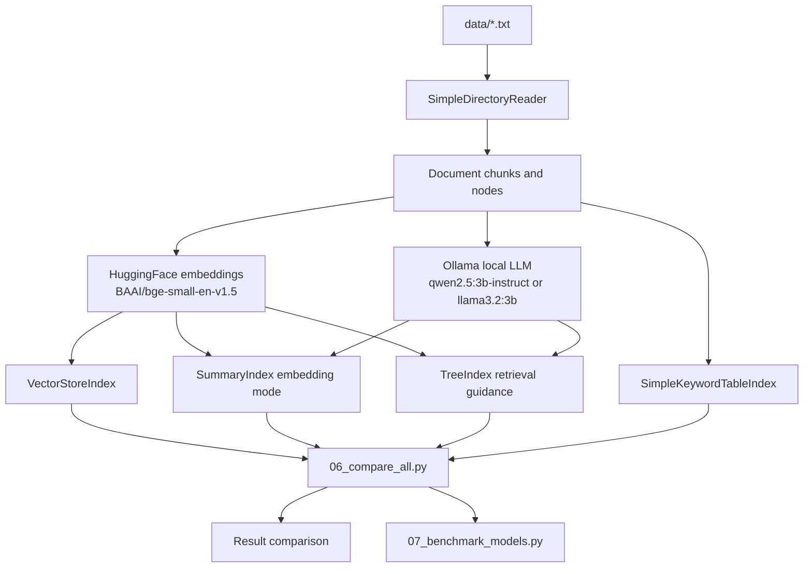
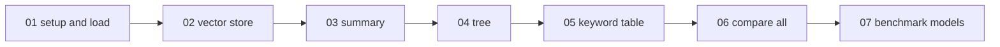
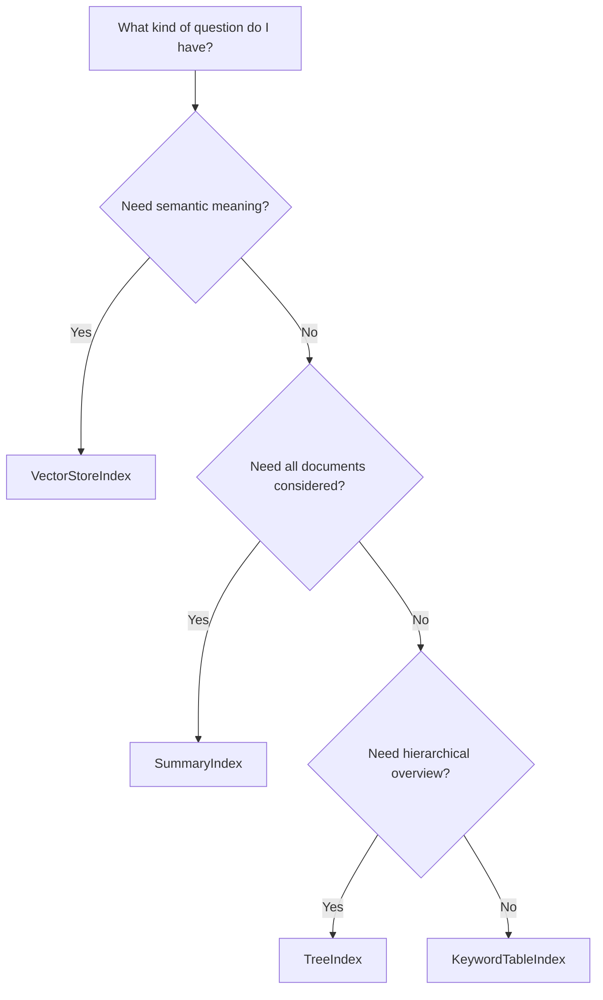
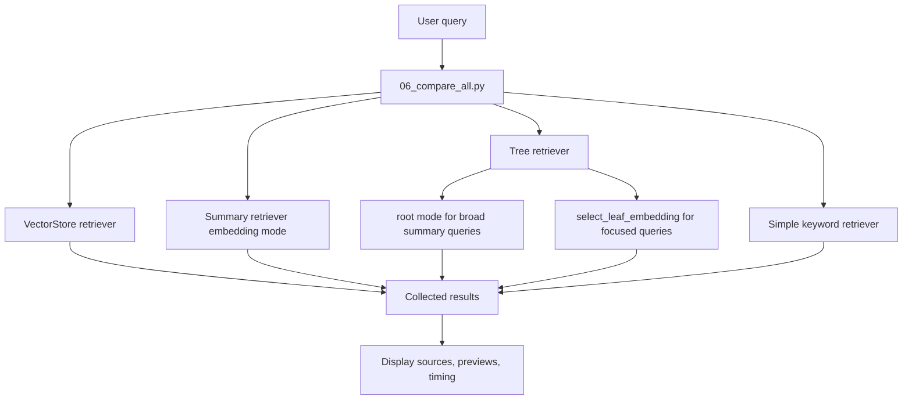
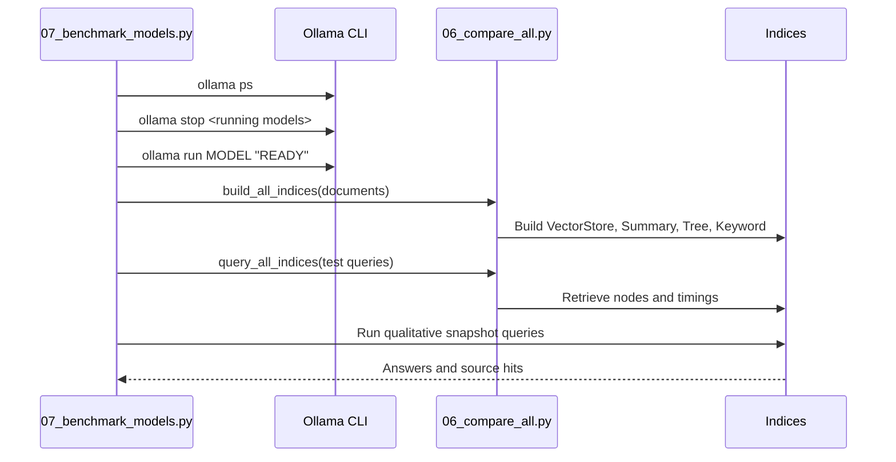
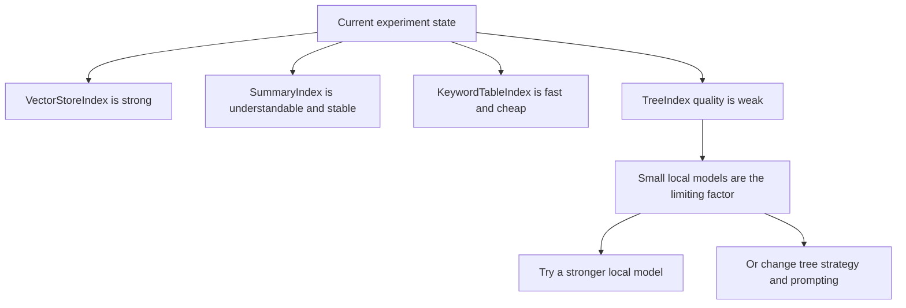

# LlamaIndex Indexers Diagrams

This file gives a visual map of the experiment so you can reason about it without
jumping between all the scripts.

## 1. Big Picture

ASCII overview:

```text
data/*.txt
   |
   v
SimpleDirectoryReader
   |
   v
Document chunks / nodes
   |
   +------------------------------+
   |                              |
   v                              v
HuggingFace embeddings       Ollama local LLM
(BAAI/bge-small-en-v1.5)     (qwen2.5:3b-instruct or llama3.2:3b)
   |                              |
   +--------------+---------------+
                  |
                  v
        +------------------------+
        | Four index experiments |
        +------------------------+
          |       |       |      |
          v       v       v      v
      Vector   Summary   Tree  Keyword
       Store     List    Hier.  Table
          \       |       |      /
           \      |       |     /
            +-----+-------+----+
                  |
                  v
        Side-by-side query comparison
             and model benchmarking
```

Mermaid overview:



## 2. Script Journey

ASCII walkthrough:

```text
01_setup_and_load.py
  -> show documents and chunking

02_vector_store_index.py
  -> semantic retrieval baseline

03_summary_index.py
  -> read-many / summarize-all behavior

04_tree_index.py
  -> hierarchical summaries and traversal

05_keyword_table_index.py
  -> simple keyword routing via regex-style extraction

06_compare_all.py
  -> same questions across all four indices

07_benchmark_models.py
  -> same workflow across multiple Ollama models
```

Mermaid script flow:



## 3. Index Behavior Map

ASCII comparison:

```text
+-------------------+------------+------------+-------------------------------+
| Index             | Build Cost | Query Cost | Best Fit                      |
+-------------------+------------+------------+-------------------------------+
| VectorStoreIndex  | medium     | low        | semantic Q&A, factual lookup  |
| SummaryIndex      | low        | high       | summarize everything          |
| TreeIndex         | high       | medium     | hierarchy, overview to detail |
| KeywordTableIndex | low        | low        | exact terms, routing          |
+-------------------+------------+------------+-------------------------------+
```

Mermaid decision map:



## 4. Compare-All Query Path

ASCII query lifecycle:

```text
User query
   |
   v
06_compare_all.py
   |
   +--> VectorStoreIndex.as_retriever(similarity_top_k=3)
   |
   +--> SummaryIndex.as_retriever(retriever_mode="embedding")
   |
   +--> TreeIndex.as_retriever(...)
   |      |- root mode for broad summarization queries
   |      `- select_leaf_embedding for focused queries
   |
   `--> SimpleKeywordTableIndex.as_retriever(retriever_mode="simple")
           |
           v
     Retrieved nodes + timing + source files
           |
           v
     Printed side-by-side comparison
```

Mermaid query flow:



## 5. Benchmark Workflow

ASCII benchmark path:

```text
07_benchmark_models.py
   |
   +--> ollama ps / ollama stop
   |      clean loaded models
   |
   +--> ollama run MODEL "READY"
   |      warm target model
   |
   +--> build_all_indices(documents)
   |
   +--> run fixed query set
   |      record timing and source hits
   |
   `--> run qualitative snapshots
          |- summary answer
          |- tree answer
          |- vector fact answer
          `- tree fact answer
```

Mermaid sequence diagram:



## 6. Current Findings

ASCII summary of where the experiment stands now:

```text
What works well:
  - VectorStoreIndex is the strongest default.
  - SummaryIndex behaves predictably.
  - KeywordTableIndex is cheap and useful for exact-term routing.
  - Benchmarking is now repeatable across local models.

What is still weak:
  - TreeIndex root summaries are poor with the current 3B local models.
  - Switching between qwen2.5:3b-instruct and llama3.2:3b changes speed more
    than it changes the core TreeIndex quality problem.

What that means:
  - The next meaningful improvement is not more documentation or more small-model
    comparison. It is either:
      1. a stronger local model, or
      2. a different TreeIndex strategy / prompt / retrieval setup.
```

Mermaid findings map:



## 7. File-Level Mental Model

```text
README.md
  human-oriented setup, usage, and latest benchmark takeaway

docs/planning/plan.md
  what the experiment set out to show and what changed in practice

docs/diagrams.md
  visual orientation for the whole experiment

src/04_tree_index.py
  deepest TreeIndex-specific demo and current weak point

src/06_compare_all.py
  central comparison harness for the four index types

src/07_benchmark_models.py
  repeatable local-model comparison harness
```