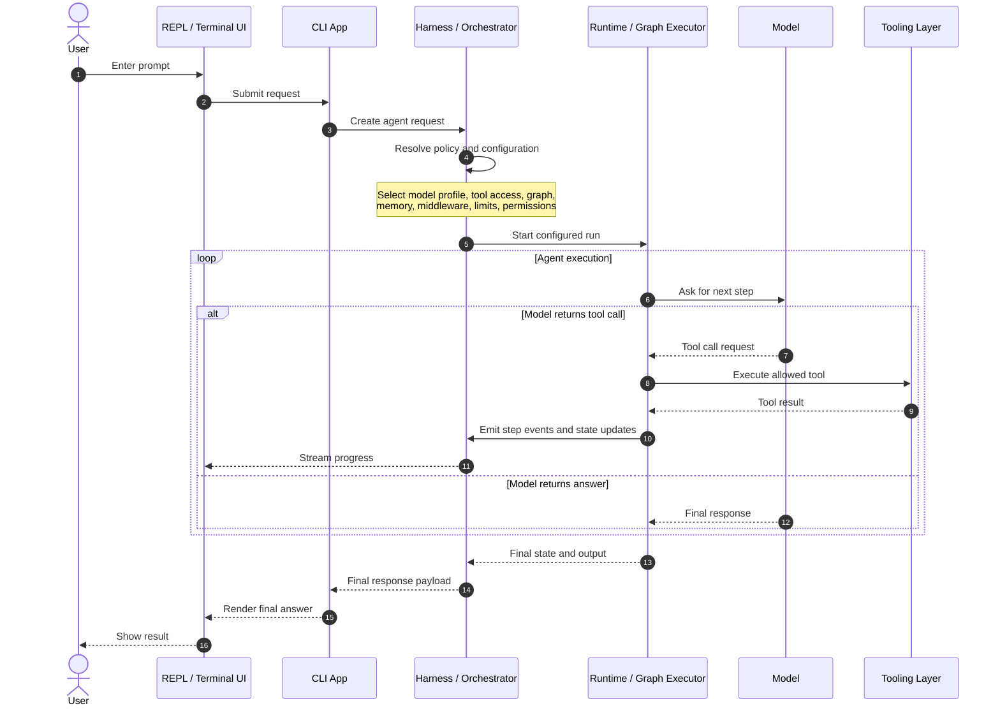

# Claude Code Style Sequence

This note captures a practical mental model for a Claude Code style agent stack.

## Layer Model

- REPL: the interactive terminal experience.
- CLI app: the host process for the agent system.
- Harness: the orchestration layer inside the CLI.
- Runtime: the execution engine for a specific agent run.
- Model and tools: the components used by the runtime while executing.

The key distinction is that the harness configures and drives the runtime. The runtime then executes the live request using the selected model, tools, graph, state, and limits.

## Sequence

## Practical Interpretation

For the wording you were using earlier, this is the most accurate version:

- The REPL wraps the CLI experience.
- The CLI hosts the harness.
- The harness prepares and configures a run.
- The runtime executes that run.
- The selected model, tools, graph, and limits are usually runtime configuration for that run, not the runtime itself.

## Short Version

Think of it this way:

- REPL: user interface
- CLI: application shell
- Harness: agent control layer
- Runtime: execution engine
- Model and tools: resources used during execution

So when a user sends a request, the harness composes the run and the runtime carries it out.