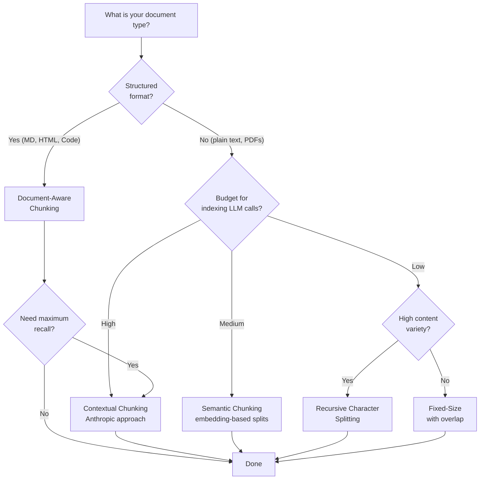
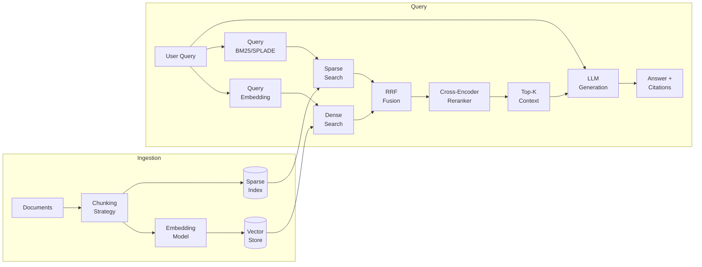
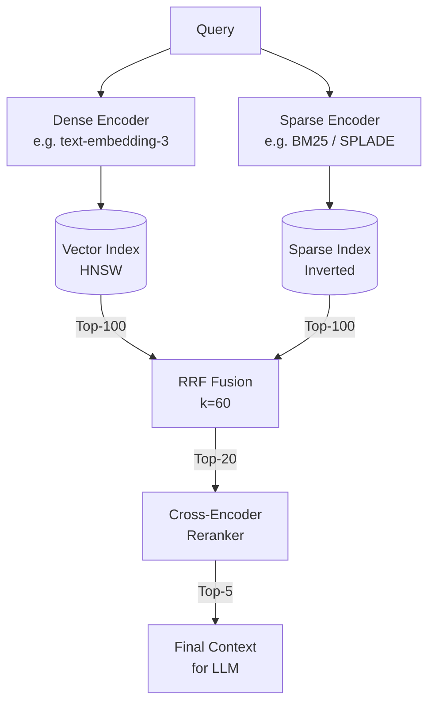
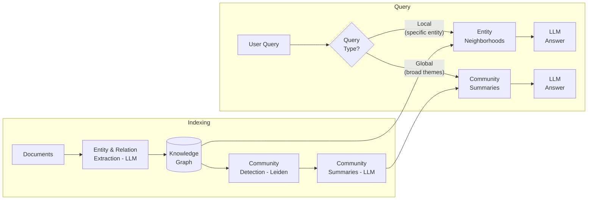
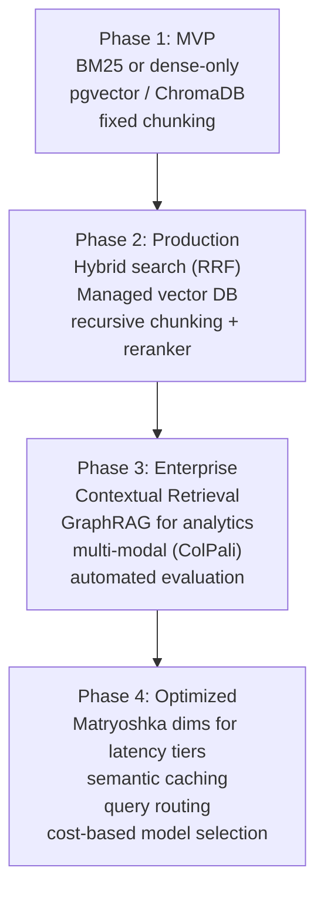

# Enterprise-Grade Vectorization and Retrieval Approaches

> Technical discussion reference — April 2026
> Covers: embedding models, chunking, vector databases, search strategies, and emerging approaches

---

## 1. Embedding Models Comparison

| Model | Provider | Dims | Max Tokens | MTEB (avg) | Multilingual | Matryoshka | Cost / 1M tokens |
|---|---|---|---|---|---|---|---|
| `text-embedding-3-small` | OpenAI | 1536 | 8191 | ~62 | Yes (100+) | Yes | ~$0.02 |
| `text-embedding-3-large` | OpenAI | 3072 | 8191 | ~65 | Yes (100+) | Yes | ~$0.13 |
| `embed-v3` | Cohere | 1024 | 512 | ~65 | Yes (100+) | No | ~$0.10 |
| `embed-v4` | Cohere | 1024 | 512 | ~67 | Yes (100+) | Yes | ~$0.10 |
| `BGE-M3` | BAAI | 1024 | 8192 | ~65 | Yes (100+) | No | Free (self-host) |
| `voyage-3` | Voyage/Anthropic | 1024 | 32000 | ~67 | Yes | No | ~$0.06 |
| `voyage-3-large` | Voyage/Anthropic | 2048 | 32000 | ~68 | Yes | No | ~$0.18 |
| `jina-embeddings-v3` | Jina AI | 1024 | 8192 | ~66 | Yes (89) | Yes | ~$0.02 |
| `text-embedding-005` | Google | 768 | 2048 | ~64 | Yes | No | ~$0.025 |

### Key Talking Points

- **Matryoshka embeddings**: Truncate vector dimensions at query time (e.g. 3072 -> 256) for speed/storage tradeoff with minimal recall loss. OpenAI and Jina support this natively.
- **Binary quantization**: Cohere embed-v3/v4 output float/int8/binary variants. Binary = 32x storage reduction, ~95% recall retention. Weaviate and Qdrant support BQ natively.
- **Input type matters**: Asymmetric embedding — use `search_document` for indexing, `search_query` for queries. Cohere and Google expose this as a parameter. Ignoring it degrades recall.
- **BGE-M3 multi-granularity**: Single model outputs dense + sparse + ColBERT vectors simultaneously. Best open-source option for hybrid search without multiple models.
- **Voyage for specialized domains**: Strongest on code retrieval and legal text. Acquired by Anthropic — expect deeper integration with Claude.
- **Open vs proprietary tradeoff**: BGE-M3 is free but needs GPU infrastructure. API models scale instantly but create vendor lock-in and ongoing cost.

---

## 2. Chunking Strategies

### 2a. Fixed-Size Chunking

- Split by token or character count with configurable overlap window (typically 10-20%)
- **Pro**: Simple, predictable, easy to reason about storage costs
- **Con**: Splits mid-sentence, mid-paragraph, mid-concept — destroys semantic coherence

### 2b. Recursive Character Splitting

- LangChain's default: splits on hierarchy `\n\n` -> `\n` -> ` ` -> `""`
- Falls through separators until chunk fits target size
- **Pro**: Preserves paragraph/section structure better than fixed
- **Con**: Still content-agnostic — doesn't understand semantic boundaries

### 2c. Semantic Chunking

- Embed rolling window of sentences, measure cosine similarity between adjacent windows
- Split where similarity drops below threshold (semantic boundary detected)
- **Pro**: Content-aware boundaries, chunks are semantically self-contained
- **Con**: Expensive — requires embedding call per sentence pair during indexing

### 2d. Document-Aware Chunking

- Parse document structure: markdown headers, HTML sections, code blocks, tables
- Split at structural boundaries, keep metadata (header hierarchy, section title)
- **Pro**: Respects author's intended structure, preserves context
- **Con**: Format-specific logic needed per document type

### 2e. Parent-Child / Contextual Chunking

- **Parent-child**: Embed small chunks (child), but retrieve the surrounding larger chunk (parent) for LLM context
- **Contextual Retrieval (Anthropic)**: For each chunk, use LLM to generate 50-100 word context prefix explaining where the chunk fits in the document, then prepend it before embedding
  - Result: **67% fewer retrieval failures** vs naive RAG (Anthropic benchmark)
  - Combine with BM25 hybrid search for best results
  - Use prompt caching to reduce LLM indexing cost
- **Pro**: Dramatically better recall — chunks retain document-level context
- **Con**: Expensive indexing (LLM call per chunk for contextual approach)

### Chunking Strategy Decision Tree

---

## 3. Vector Database Comparison

| Database | Hosting | Max Scale | Filtering | Hybrid Search | Quantization | Pricing Model | Notable Feature |
|---|---|---|---|---|---|---|---|
| **Pinecone** | Managed only | Billions (serverless) | Metadata filters | Sparse-dense | Product quant | Pay-per-read ($0.33/1M) | Serverless auto-scaling |
| **Weaviate** | Self-managed + Cloud | Billions | GraphQL filters | BM25 + vector | BQ, PQ | Open-source / Cloud tiered | Generative search modules |
| **Qdrant** | Self-managed + Cloud | Billions | Payload filters (rich) | Sparse + dense | PQ, BQ, SQ | Open-source / Cloud tiered | Named vectors, multi-vec |
| **Milvus** | Self-managed + Zilliz | 10B+ | Attribute filters | Sparse + dense | IVF, PQ, SQ | Open-source / Zilliz tiered | GPU-accelerated, DiskANN |
| **pgvector** | Self-managed (PG ext) | ~5-10M practical | SQL WHERE | BM25 via pg + vector | None native | Free (extension) | Familiar Postgres ops |
| **ChromaDB** | Embedded / client-server | ~1M practical | Metadata filters | No native | None | Open-source | Python-native, simple API |
| **Azure AI Search** | Managed (Azure) | Billions | OData filters | BM25 + vector native | SQ | Azure consumption pricing | Semantic ranker, Azure RBAC |
| **Elasticsearch** | Self-managed + Cloud | Billions | Full Lucene query DSL | BM25 + dense native | None native | Open-source / Elastic Cloud | ELSER sparse model, mature ecosystem |

### Key Talking Points

- **Hybrid search is table stakes**: Any production system should support dense + sparse. Pinecone, Weaviate, Qdrant, Milvus, Azure AI Search, Elasticsearch all do.
- **pgvector "good enough"** for <5M vectors when you already have Postgres. Avoid adding a new database to your stack unless you need it.
- **Multi-tenancy matters for SaaS**: Weaviate (tenant isolation), Qdrant (collection per tenant), Pinecone (namespaces). Critical for data isolation compliance.
- **Managed vs self-managed**: Managed = lower ops cost, higher per-query cost. Self-managed = full control, need expertise. Start managed, migrate if cost/compliance demands it.
- **Azure AI Search** is the pragmatic choice for enterprise Azure shops — native RBAC, built-in semantic ranker, integrated with Azure OpenAI.

---

## 4. Search Approaches

### 4a. Dense Retrieval (ANN / HNSW)

- **How it works**: Embed query, find k-nearest vectors via Approximate Nearest Neighbors
- **HNSW** (Hierarchical Navigable Small World): graph-based index, O(log n) search
  - Key params: `ef_construction` (build quality), `M` (connections per node), `ef_search` (query quality/speed)
  - Higher ef = better recall, more latency
- **Distance metrics**: Cosine similarity (normalized), dot product (unnormalized), Euclidean (L2)
- **Strength**: Semantic matching — "automobile" matches "car"
- **Weakness**: Misses exact keywords, entity names, acronyms

### 4b. Sparse Retrieval (BM25, SPLADE)

- **BM25**: Term frequency-inverse document frequency. No training needed. Exact keyword matching.
  - Strength: Precise term matching, zero-shot, no model needed
  - Weakness: No semantic understanding — "car" won't match "automobile"
- **SPLADE**: Learned sparse representations via MLM head
  - Generates sparse vector with expanded vocabulary (adds semantically related terms)
  - Better than BM25 for semantic matching while keeping sparse efficiency
  - Elasticsearch ELSER is a production SPLADE variant
- **Strength**: Exact keyword/entity matching, interpretable, efficient
- **Weakness**: Limited semantic understanding (BM25), requires training (SPLADE)

### 4c. Hybrid Search

- **Reciprocal Rank Fusion (RRF)**: Merge ranked lists without score normalization
  - `RRF_score(d) = sum(1 / (k + rank_i(d)))` where k=60 is typical
  - Simple, effective, no tuning needed
- **Weighted combination**: `alpha * dense_score + (1-alpha) * sparse_score`
  - Typical best: alpha = 0.5-0.7 for general queries
  - Higher alpha (more dense) for semantic/conceptual queries
  - Lower alpha (more sparse) for keyword/entity queries
- **Why hybrid wins**: Dense catches semantic matches, sparse catches exact terms. Together they cover both failure modes.

### 4d. Reranking

- **Cross-encoders**: Jointly encode (query, document) pair through full transformer
  - Cohere Rerank v3, BGE-reranker-v2, Jina Reranker v2
  - 10-50x slower than bi-encoders but dramatically better relevance
- **Pattern**: Retrieve 50-100 candidates with fast retrieval (dense/sparse/hybrid), rerank to top-k
- **Why it works**: Bi-encoders compress to single vector (lossy). Cross-encoders see full query+doc interaction.
- **Cost**: Cohere Rerank ~$2/1000 queries. Self-hosted BGE-reranker needs GPU.

### End-to-End RAG Pipeline

### Hybrid Search Detail

---

## 5. Advanced / Hot Approaches

### 5a. ColBERT / Late Interaction Models

- **How it works**: Instead of one vector per document, generate a vector **per token**
  - Query: N token vectors. Document: M token vectors
  - **MaxSim**: For each query token, find max similarity against all doc tokens, then sum all MaxSims
- **ColBERT v2**: Residual compression reduces storage 6-10x
- **Why it matters**:
  - Preserves token-level matching granularity lost in single-vector bi-encoders
  - Better out-of-distribution generalization
  - Especially strong for complex, multi-faceted queries
- **Tradeoff**: Larger index (M vectors per doc instead of 1), but much better recall for complex queries
- **Production**: RAGatouille library, Vespa native ColBERT support

### 5b. GraphRAG (Microsoft Research)

- **The problem it solves**: Vanilla RAG fails on questions that span many documents — "what are the main themes across all reports?"
- **Pipeline**:
  1. **Entity extraction** (LLM): Extract entities and relationships from each chunk
  2. **Knowledge graph**: Build graph of entities → relationships
  3. **Community detection** (Leiden algorithm): Find clusters of related entities
  4. **Community summaries** (LLM): Generate summary for each community
- **Query modes**:
  - **Local search**: Start from entities in query, traverse neighborhoods, use local context
  - **Global search**: Use community summaries to answer broad questions
- **Cost**: Expensive indexing (many LLM calls). But global queries are **impossible** with vanilla RAG.
- **Best for**: Analytical questions across large document corpora, "summarize all...", "what patterns emerge..."

### 5c. Contextual Retrieval (Anthropic, 2024)

- **Core idea**: Chunks lose context when separated from their document. Restore it.
- **Method**: For each chunk, prompt LLM to generate a 50-100 word context prefix:
  - *"This chunk is from the Q3 financial report, specifically the section on APAC revenue growth..."*
  - Prepend to chunk before embedding AND before BM25 indexing
- **Results** (Anthropic benchmark):
  - Contextual embeddings alone: 35% fewer failures
  - Contextual embeddings + BM25 hybrid: 49% fewer failures
  - Contextual embeddings + BM25 + reranking: **67% fewer failures**
- **Cost optimization**: Use prompt caching — the document preamble is cached, only the chunk-specific prompt varies
- **Key insight**: Simple technique, massive impact. Should be default for any production RAG.

### 5d. Vectorless Retrieval / BM25 + LLM Query Expansion

- **Core idea**: Skip embeddings entirely. Use LLM to rewrite user query into multiple search-optimized variants, run BM25 over each, merge results.
- **Why it works**:
  - LLM query expansion adds synonyms, rephrasings, and related terms
  - Multiple BM25 queries cover more vocabulary than single query
  - Surprisingly competitive with dense retrieval for many use cases
- **Advantages**:
  - No embedding model, no vector database, no indexing pipeline
  - Works on existing search infrastructure (Elasticsearch, Solr, Postgres full-text)
  - Zero cold-start — works immediately on any text corpus
- **When to use**: Legacy systems, budget constraints, when BM25 infra already exists
- **Limitations**: Still weaker than hybrid search for purely semantic queries

### 5e. Structured Retrieval

- **Text-to-SQL**: LLM generates SQL from natural language, executes against structured data
  - Best for tabular data, metrics, aggregations
  - Chain: query → schema context → LLM → SQL → execute → format result
- **Metadata filtering**: Pre-filter vector search by structured attributes
  - Date ranges, document type, author, department, confidentiality level
  - Filter THEN search (reduces search space) vs search THEN filter (may miss relevant docs)
- **Router pattern**: Classify query as structured vs unstructured, route to appropriate pipeline
  - "What was Q3 revenue?" → Text-to-SQL
  - "Explain our pricing strategy" → Vector search
  - LLM-based router or keyword heuristics

### 5f. Multi-Modal Retrieval / ColPali

- **The problem**: Tables, charts, complex layouts, scanned documents lose information in text extraction
- **ColPali**: Vision-language model processes document **page images** directly
  - Late interaction between query token embeddings and image patch embeddings
  - No OCR, no text extraction, no layout parsing needed
- **How it works**:
  - Index: Run vision model over each page image → patch embeddings (like ColBERT but for images)
  - Query: Encode query text → token embeddings
  - Match: MaxSim between query tokens and image patches
- **Best for**: Financial tables, technical diagrams, scanned PDFs, mixed-layout documents
- **Tradeoff**: Larger index, GPU inference required, but handles layout that text extraction loses
- **Production readiness**: Emerging — Vespa supports it, active research area

---

## 6. Decision Matrix

| Use Case | Recommended Approach | Why |
|---|---|---|
| Standard Q&A over docs | Hybrid search (dense + BM25) + reranker | Best recall/precision balance |
| Cross-document synthesis | GraphRAG | Only approach that handles global queries |
| Code search | Voyage code embeddings + dense search | Voyage leads on code MTEB |
| Complex document layouts | ColPali multi-modal | Preserves visual layout information |
| Maximum recall on critical data | Contextual Retrieval + hybrid + reranker | Anthropic's 67% failure reduction |
| Legacy search infrastructure | BM25 + LLM query expansion | No new infrastructure needed |
| Budget-constrained startup | BGE-M3 + pgvector | Free model + existing Postgres |
| Enterprise Azure shop | Azure AI Search + text-embedding-3 | Native RBAC, semantic ranker, integrated |
| Real-time / low latency | Dense only (skip reranker) + Matryoshka dims | Fastest path, trade recall for speed |
| Multi-tenant SaaS | Qdrant or Weaviate + contextual chunking | Native tenant isolation + quality |

### Architecture Evolution Path

---

## Quick Reference: Numbers to Know

| Metric | Typical Value |
|---|---|
| Embedding latency (API) | 50-200ms per batch |
| HNSW search latency | 1-10ms for 1M vectors |
| Reranker latency | 50-200ms for top-20 |
| Chunk size sweet spot | 256-512 tokens |
| Overlap | 10-20% of chunk size |
| Hybrid alpha (dense weight) | 0.5-0.7 |
| RRF k parameter | 60 (standard) |
| Retrieval top-k before rerank | 50-100 |
| Final context top-k | 3-8 chunks |
| Contextual Retrieval prefix | 50-100 words per chunk |
| BQ storage reduction | ~32x |
| ColBERT storage overhead | ~10-50x vs single vector |
