# Enterprise-Grade Agentic Workflows for Process Automation

> Technical discussion reference — April 2026
> Covers: orchestration patterns, frameworks, enterprise workflows, state management, HITL, error handling

---

## 1. Agent Orchestration Patterns

### 1a. Single Agent (ReAct)

- **Pattern**: LLM reasons → calls tool → observes result → reasons again → repeats until done
- **When**: Simple tasks, 1-5 tools, no branching logic, single domain
- **Limitation**: Context window fills up on complex multi-step tasks

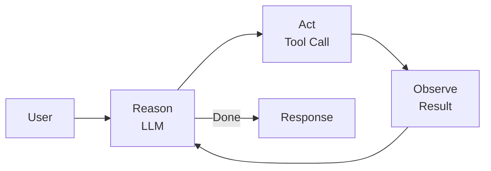

### 1b. Sequential Chain (Pipeline)

- **Pattern**: Agent A output → Agent B input → Agent C input → final output
- **When**: Ordered processing stages where each transforms the previous output
- **Example**: Draft → Review → Edit → Format
- **Advantage**: Simple mental model, easy to debug, predictable execution order

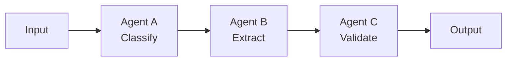

### 1c. Parallel Fan-Out / Fan-In

- **Pattern**: Router splits work → N agents execute in parallel → Aggregator merges results
- **When**: Independent subtasks, latency-sensitive, research/analysis tasks
- **Example**: Research question → [search web, search docs, search code] → merge findings

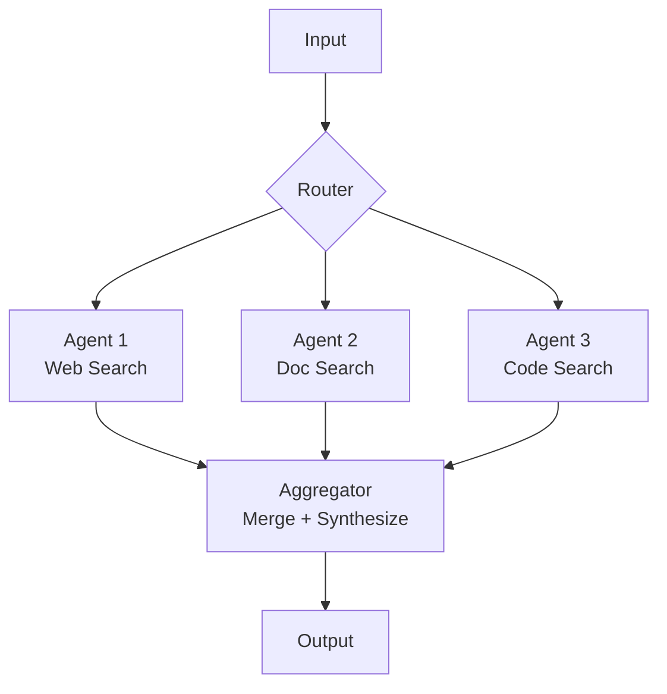

### 1d. Hierarchical (Manager / Worker)

- **Pattern**: Orchestrator LLM plans and delegates to specialist agents, each with their own tools
- **When**: Complex multi-domain tasks requiring different expertise/toolsets
- **Example**: Project manager agent delegates to research agent, coding agent, testing agent
- **Key design**: Manager sees only summaries, not raw worker output — preserves context

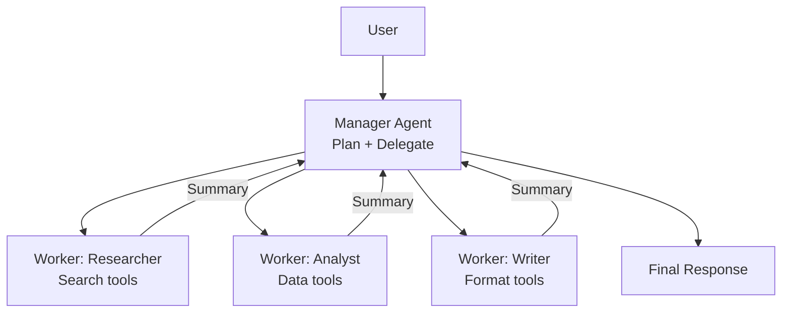

### 1e. Graph-Based (LangGraph StateGraph)

- **Pattern**: Nodes = functions/agents, edges = conditional routing, typed state flows through graph
- **When**: Complex workflows with branching, loops, error recovery, conditional paths
- **Key feature**: Cycles allowed — enables retry loops, human review loops, iterative refinement
- **State**: TypedDict with reducers (e.g. `messages: Annotated[list, add_messages]`)

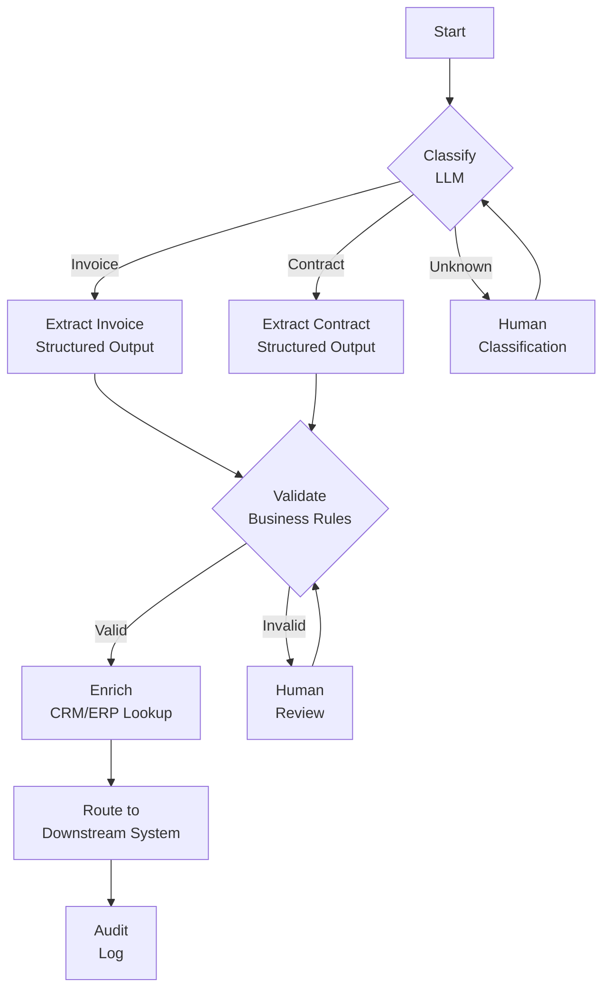

### 1f. Event-Driven

- **Pattern**: Message queue triggers agent execution, results published back to queue
- **When**: Async processing, high throughput, decoupled systems, multiple consumers
- **Example**: New email arrives → Kafka topic → agent classifies and routes → publishes result

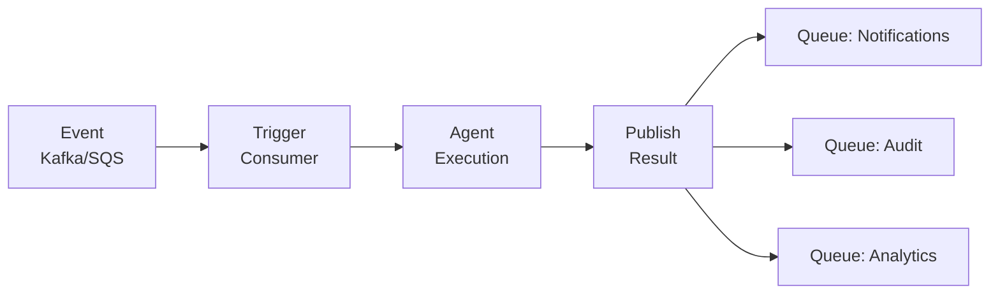

### Pattern Comparison

| Pattern | Complexity | Latency | Fault Tolerance | Observability | Best For |
|---|---|---|---|---|---|
| Single ReAct | Low | Low | Low | Simple (linear trace) | Simple Q&A, tool use |
| Sequential | Low | Medium | Medium | Easy (pipeline trace) | Document processing |
| Parallel Fan-Out | Medium | Low (parallel) | Medium | Moderate (branch trace) | Research, analysis |
| Hierarchical | High | Medium | High | Complex (tree trace) | Multi-domain tasks |
| Graph-Based | High | Variable | High | Complex (graph trace) | Conditional workflows |
| Event-Driven | High | Variable | Highest | Distributed tracing | Async, high throughput |

---

## 2. Framework Comparison

| Framework | Languages | Orchestration Model | State Mgmt | HITL | Streaming | Enterprise Readiness |
|---|---|---|---|---|---|---|
| **LangGraph** | Python, JS/TS | StateGraph (nodes + edges) | Checkpointer | interrupt_before/after | Yes | High (LangSmith, Platform) |
| **CrewAI** | Python | Role-based agents + Process | Built-in memory | Yes (human tool) | Yes | Medium |
| **AutoGen / AG2** | Python | Conversation-based multi-agent | Chat history | Yes (human proxy) | Yes | Medium (research-oriented) |
| **Google ADK** | Python, Java | Agent → Tool → Session → Runner | Session state | Callbacks | Yes | High (Vertex AI deploy) |
| **Semantic Kernel** | C#, Python, Java | Kernel + Plugins + Planner | Kernel memory | Manual | Yes | High (Azure ecosystem) |
| **Temporal + LLM** | Any (polyglot) | Durable workflow engine + LLM activities | Event-sourced | Signal/query | No native | Highest (battle-tested infra) |

### Key Talking Points

- **LangGraph** is the de facto standard for custom agent orchestration. Most flexibility, best tooling (LangSmith traces), largest ecosystem.
- **CrewAI** is higher-level — faster to prototype, less control. Good for "3 agents collaborating on a report" patterns. Less suitable for complex conditional flows.
- **Google ADK** is strong for Google Cloud native. Agent-to-Agent (A2A) protocol for inter-agent communication. Gemini-first but model-agnostic.
- **Semantic Kernel** is the pragmatic choice for .NET/Microsoft shops. Planner handles basic orchestration, Kernel filters for middleware. Deep Azure OpenAI integration.
- **Temporal + LLM** is the nuclear option — durable execution guarantees (retries, timeouts, versioning) that no LLM framework matches. Use when you already have Temporal and need bulletproof reliability. LLM calls become just another Temporal activity.
- **Most enterprises** will use LangGraph for new projects, or Temporal+LLM for regulated industries needing auditable durable workflows.

---

## 3. Enterprise Workflow Patterns

### 3a. Document Processing Pipeline

The most common enterprise agent automation. Replaces manual document intake and routing.

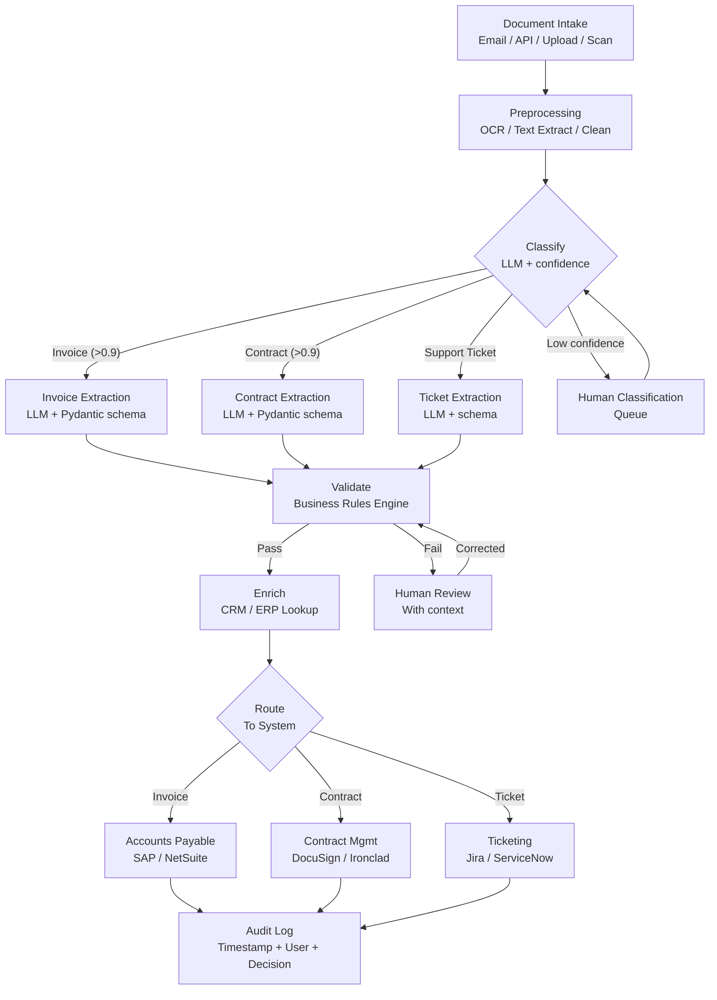

**Key design decisions:**
- LLM for classification and extraction, **rules engine for validation** — deterministic checks shouldn't use LLM
- **Structured output** (Pydantic models / JSON schema) for extraction — ensures downstream compatibility
- **Confidence thresholds** determine human routing — tune per document type
- **Idempotency keys** for retry safety — same document shouldn't create duplicate entries

### 3b. Approval Workflows with HITL

- **Interrupt points** before sensitive actions (financial transactions, contract signing, customer communications)
- **Escalation chains**: auto-approve if confidence > threshold, escalate to L1 → L2 → manager if not
- **Timeout handling**: If no response in X hours, re-escalate or auto-reject with notification
- **Audit requirement**: Every approval/rejection logged with approver identity, timestamp, reason

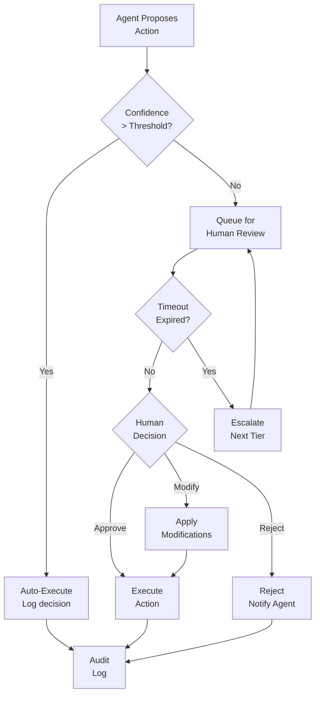

### 3c. Multi-Step Data Enrichment

- **Entity resolution**: Match records across systems (fuzzy name matching, ID dedup)
- **Parallel enrichment**: Call multiple APIs simultaneously (Clearbit, LinkedIn, D&B, internal CRM)
- **Merge/dedup logic**: Agent resolves conflicts between sources (recency, authority ranking)
- **Caching**: Cache enrichment results with TTL — avoid redundant API calls
- **Pattern**: Fan-out to enrichment APIs → fan-in with conflict resolution → write to master record

### 3d. Incident Response Automation

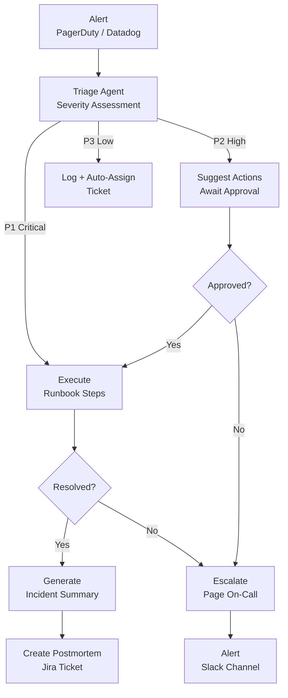

**Guardrails**: Never auto-remediate production without approval. Agent can diagnose, suggest, and prepare — but a human executes destructive fixes.

---

## 4. State Management

### Core Concepts

- **State**: Typed dictionary flowing through the graph. Defined via `TypedDict` with annotated reducers.
- **Checkpointing**: Full state snapshot saved after each node execution. Enables resume after failure.
- **Thread**: A conversation/session identifier. All state for one execution lives under one thread ID.
- **Run**: A single invocation within a thread. Multiple runs can share thread state (continuing a conversation).

### Persistence Backends

| Backend | Use Case | Durability | Latency | Scalability |
|---|---|---|---|---|
| `MemorySaver` | Development, testing | None (in-process) | ~0ms | Single process |
| `SqliteSaver` | Local dev, single-user | Disk | ~1ms | Single process |
| `PostgresSaver` | Production | Full (WAL) | ~5ms | Multi-process, replicas |
| `RedisSaver` | High-throughput, caching | Configurable (AOF/RDB) | ~1ms | Clustered |

### State Design Best Practices

- Keep state **typed** (`TypedDict`) — catches errors early, documents the contract
- Use **reducers** for list fields: `messages: Annotated[list, add_messages]` — appends instead of overwrites
- Avoid storing large blobs in state — use references (file paths, URLs, IDs)
- **Partition state by concern**: separate `messages`, `metadata`, `tools_state`, `user_context`
- **Immutability**: Each node returns new state values, reducer merges — never mutate in place

### Checkpointing and Recovery

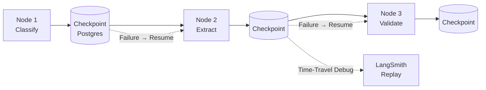

**Key talking points:**
- **Resume from failure**: If Node 3 crashes, restart from Checkpoint 2 — no re-processing
- **Time-travel debugging**: Load any historical checkpoint in LangSmith, inspect state at that point
- **Versioning**: When you change the graph, old checkpoints may be incompatible — migration strategy needed

---

## 5. Human-in-the-Loop (HITL)

### LangGraph Interrupt Mechanism

- `interrupt_before=["tool_name"]` — Pause execution **before** the tool call, show proposed args to human
- `interrupt_after=["tool_name"]` — Pause execution **after** the tool call, show result to human for review
- Implementation: Graph execution yields at interrupt point, state is checkpointed, resumes when `Command(resume=...)` is called

### HITL Design Patterns

| Pattern | Trigger | Human Action | Use Case |
|---|---|---|---|
| **Approval gate** | Before sensitive tool | Approve / Modify / Reject | Financial transactions, emails |
| **Review gate** | After extraction/generation | Accept / Edit / Regenerate | Document processing, content creation |
| **Confidence threshold** | LLM confidence < threshold | Classify / Verify | Ambiguous inputs, edge cases |
| **Escalation chain** | Timeout or rejection | Route to next tier | Support workflows, incident response |
| **Feedback loop** | After final output | Rate quality, provide correction | Continuous improvement |

### HITL Architecture

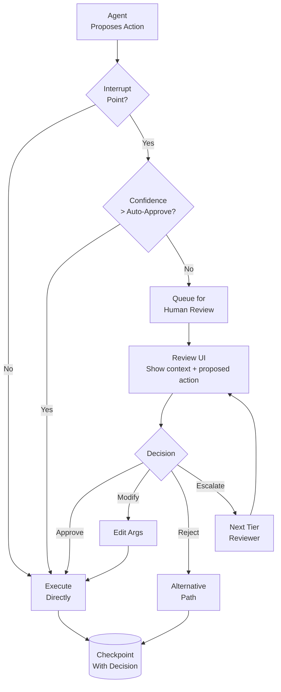

**Key talking points:**
- HITL is a **spectrum**, not binary. Fully autonomous → confidence-gated → always-human.
- Start with **always-human** for sensitive actions, relax to confidence-gated as trust builds.
- Every human decision becomes **training signal** — log it, use for evaluation, potentially fine-tune.
- **Latency impact**: HITL adds minutes/hours. Design the surrounding workflow to be async — don't block other processing while waiting.

---

## 6. Enterprise Concerns

### RBAC (Role-Based Access Control)

- **Tool-level permissions**: Define which user roles can invoke which tools
  - Admin: all tools including `delete_record`, `execute_sql`
  - Analyst: `read_file`, `search_kb`, `generate_report`
  - Viewer: `search_kb` only
- **Implementation**: User role in `context_schema` (LangGraph config), middleware checks before tool execution
- **Data-level**: Filter tool results by user's data access permissions (row-level security for SQL tools)

### Audit Trails

- Every LLM call: input messages, output message, model, tokens used, latency
- Every tool invocation: tool name, args, result, duration, success/failure
- Every human decision: approver identity, action, timestamp, reason
- Every state transition: from-node, to-node, state diff
- **Format**: Structured JSON logs → SIEM (Splunk, Elastic, Datadog)
- **Retention**: Per compliance framework (SOX: 7 years, GDPR: varies, HIPAA: 6 years)

### Cost Controls

| Control | Implementation | Fallback |
|---|---|---|
| Token budget per request | Count tokens per LLM call, abort if cumulative > limit | Return partial result with warning |
| Daily budget per user/tenant | Aggregate token counts in Redis, check before each call | Queue request, notify user |
| Model tiering | Route simple queries to cheaper model, complex to expensive | Always fallback to cheapest |
| Caching | Semantic cache (embed query, check similarity to cached queries) | Skip cache, accept cost |
| Rate limiting | Leaky bucket per tenant | 429 with retry-after header |

### Compliance & Governance

- **Data residency**: Choose model provider and vector DB region to match compliance requirements (GDPR → EU, CCPA → US)
- **PII handling**: Detect and redact PII before logging, optionally before sending to LLM
- **Model governance**: Track which model version was used for each decision — critical for audits
- **Deterministic fallback**: If LLM fails, exceeds budget, or is unavailable — fall back to rules engine for critical paths

---

## 7. Error Handling

### Retry Strategies

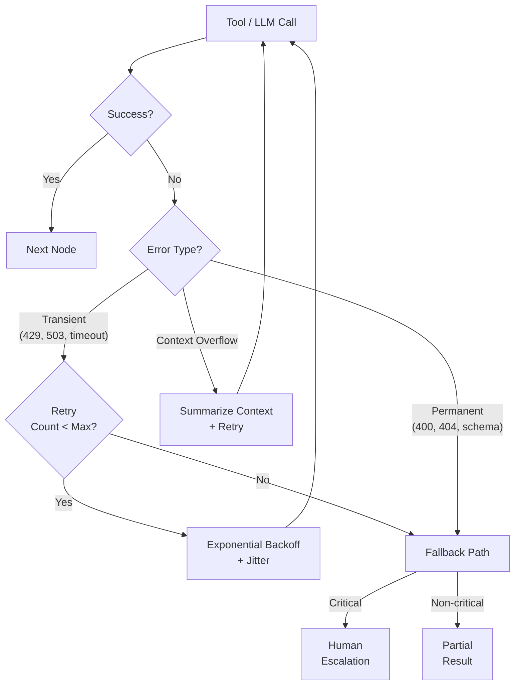

### Error Handling Patterns

| Pattern | When | Implementation |
|---|---|---|
| **Exponential backoff** | Transient API failures (429, 503) | `delay = base * 2^attempt + random_jitter` |
| **Circuit breaker** | Tool fails N times in window | Stop calling, route to fallback for cooldown period |
| **Graceful degradation** | Non-critical tool unavailable | Return partial result with confidence warning |
| **Context overflow** | Token limit exceeded | Auto-summarize older messages, retry (deepagents pattern) |
| **Structured output retry** | LLM output doesn't match schema | Append parse error to messages, ask LLM to fix |
| **Human escalation** | All automated paths exhausted | Queue for human with full context + attempted actions |

### LangGraph Error Handling

- **Node-level try/except**: Catch errors in node functions, route to error handling node via conditional edge
- **Checkpoint before risky ops**: If the risky operation fails, resume from pre-operation state
- **Global error handler**: `on_error` callback in graph compilation — catches unhandled exceptions
- **Timeout per node**: Set maximum execution time, abort and route to fallback if exceeded

### Key Talking Points

- **Never silent-fail**: Every error should be logged, surfaced, or escalated — never swallowed
- **Idempotency**: Every tool call should be safe to retry — use idempotency keys for external API calls
- **Partial results > no results**: If 3 of 4 enrichment calls succeed, return what you have with confidence indicator
- **Context overflow is a feature**: Deep agents systems handle this automatically (auto-summarization), not an error — design for it

---

## 8. Putting It Together: Enterprise Agentic Platform Architecture

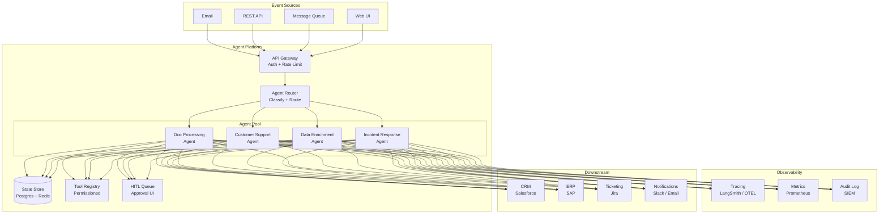

---

## Quick Reference: Key Numbers

| Metric | Typical Value |
|---|---|
| ReAct loop iterations (single agent) | 3-10 steps |
| Max recommended tools per agent | 10-15 (beyond this, use subagents) |
| Checkpoint write latency (Postgres) | ~5ms |
| HITL response time (enterprise) | Minutes to hours |
| Context window utilization target | <85% (leave room for tool output) |
| Cost per agent execution (GPT-4o) | $0.01-0.50 depending on complexity |
| Retry max attempts | 3 (transient), 0 (permanent errors) |
| Circuit breaker threshold | 5 failures in 60 seconds |
| Audit log retention | 7 years (SOX), 6 years (HIPAA) |
