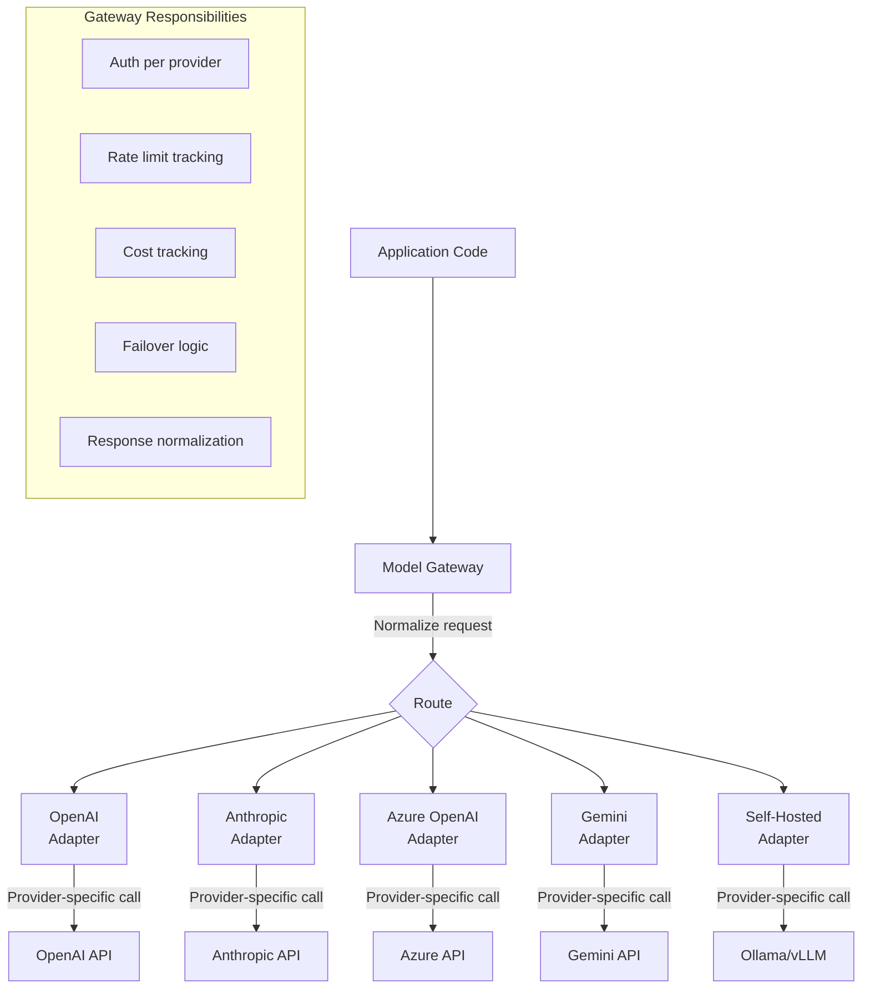
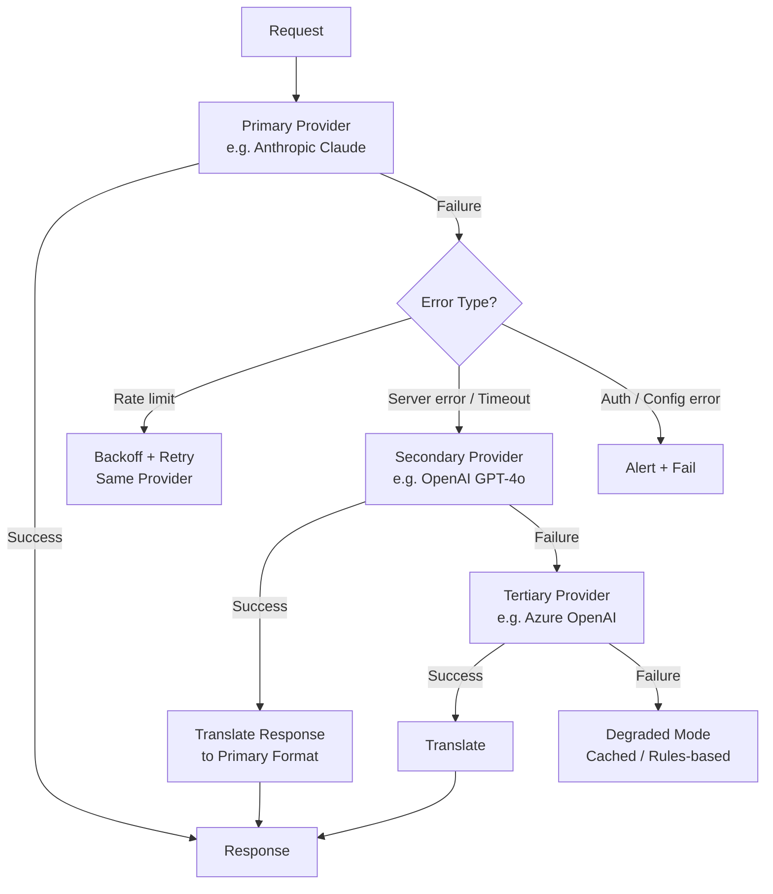

# LLM Provider API Snake Pits

> The reality of "OpenAI-compatible" APIs and cross-provider portability
> April 2026 — every provider is a pit, this is where the snakes are

---

## The Core Problem

There are two canonical LLM API contracts: **OpenAI's Chat Completions API** and **Anthropic's Messages API**. Every other provider either implements one of these (usually OpenAI's) or invents their own. The promise is "just swap the base URL." The reality is that every provider has subtle incompatibilities that surface at the worst possible time — in production, under load, on the edge case you didn't test.

"OpenAI-compatible" means "the basic happy path works." It does NOT mean tool calling behaves the same, streaming events are identical, error codes match, rate limit headers exist, thinking tokens are accessible, or multi-modal inputs are handled consistently.

---

## 1. The Two API Contracts

### OpenAI Chat Completions

```
POST /v1/chat/completions
{
  "model": "gpt-4o",
  "messages": [
    {"role": "system", "content": "..."},
    {"role": "user", "content": "..."},
    {"role": "assistant", "content": "...", "tool_calls": [...]},
    {"role": "tool", "content": "...", "tool_call_id": "..."}
  ],
  "tools": [...],
  "response_format": {"type": "json_schema", "json_schema": {...}},
  "stream": true
}
```

- De facto industry standard — most providers claim compatibility
- `system` / `user` / `assistant` / `tool` message roles
- Tool calls are part of the `assistant` message, tool results are `tool` role messages
- Structured output via `response_format` with JSON schema
- Streaming via SSE with `data: {"choices": [{"delta": {...}}]}` events

### Anthropic Messages API

```
POST /v1/messages
{
  "model": "claude-sonnet-4-6-20250514",
  "system": "...",
  "messages": [
    {"role": "user", "content": "..."},
    {"role": "assistant", "content": [
      {"type": "text", "text": "..."},
      {"type": "tool_use", "id": "...", "name": "...", "input": {...}}
    ]},
    {"role": "user", "content": [
      {"type": "tool_result", "tool_use_id": "...", "content": "..."}
    ]}
  ],
  "tools": [...],
  "stream": true
}
```

- `system` is a top-level field, NOT a message role
- Content is **block-based** — an assistant turn can contain multiple content blocks (text + tool_use mixed)
- Tool results go in a `user` message as `tool_result` blocks, not as a separate `tool` role
- Streaming uses distinct SSE event types (`message_start`, `content_block_start`, `content_block_delta`, etc.)
- No `response_format` — uses tool-based structured output or prompt engineering

### Why This Matters

These are fundamentally different data models. OpenAI treats tool calls as metadata on an assistant message. Anthropic treats them as content blocks that can interleave with text. This difference cascades into every abstraction layer that tries to normalize them.

---

## 2. The "OpenAI-Compatible" Lie (By Degree)

Every provider's compatibility claim falls somewhere on this spectrum:

| Level | What Works | What Breaks | Providers |
| --- | --- | --- | --- |
| **Full** | Everything including streaming, tools, structured output, vision | Edge cases only | Azure OpenAI (it IS OpenAI) |
| **High** | Basic chat, streaming, tool calling, vision | Structured output quirks, streaming event differences, thinking tokens | Mistral, Groq, Together AI |
| **Medium** | Basic chat, streaming, some tool calling | Tool calling edge cases, no structured output, streaming format diffs | Ollama, vLLM, most self-hosted |
| **Surface** | Basic chat completions with the same URL pattern | Tools unreliable, streaming incomplete, error format different | Many smaller providers, some proxy services |
| **Wrapper** | Translates to native API behind a compatibility shim | Loses provider-specific features entirely | LiteLLM (by design), some gateway products |

---

## 3. Provider-by-Provider Snake Map

### OpenAI (the reference implementation)

The baseline everything else is measured against. But even OpenAI has its own pitfalls:

- **Model version drift**: `gpt-4o` is a moving target. Today's `gpt-4o` is not last month's `gpt-4o`. Pin to `gpt-4o-2024-08-06` or you're on a treadmill.
- **Structured output**: `response_format: {type: "json_schema"}` works well BUT the model sometimes refuses if the schema conflicts with safety guidelines. A perfectly valid extraction schema can get a refusal because the content triggers a filter.
- **Streaming + tool calls**: Works, but tool call arguments stream as string chunks — you get partial JSON until the tool call is complete. You must buffer and parse at the end.
- **Parallel tool calls**: Enabled by default. Model can request 3 tool calls in one turn. Your code must handle an array of tool calls, not assume one at a time. Set `parallel_tool_calls: false` if your tools have dependencies.
- **Reasoning models (o1, o3)**: Different API behavior — no system message support (initially, relaxed later), no streaming (initially), no temperature control. The API contract looks the same but the constraints are different per model family.

### Anthropic

Not OpenAI-compatible by design. Uses its own Messages API. The snakes:

- **No `system` role in messages**: System prompt is a top-level parameter. Every abstraction layer (LangChain, LiteLLM) must translate this. Some do it wrong — they stuff the system message into the first user message, which changes behavior.
- **Content blocks, not strings**: An assistant message contains `[{"type": "text", "text": "..."}, {"type": "tool_use", ...}]`. Code that expects `message.content` to be a string breaks. It's a list of blocks.
- **Tool results in user messages**: After a tool call, the result goes in a `user` message with `type: "tool_result"`. Not a `tool` role message like OpenAI. Translation layers must handle this mapping.
- **Streaming is event-typed**: Anthropic streams as `message_start` → `content_block_start` → `content_block_delta` → `content_block_stop` → `message_delta` → `message_stop`. Each event type has different payload structure. OpenAI streams as `data: {choices: [{delta: {...}}]}` uniformly. Your streaming parser is completely different.
- **Thinking/extended thinking**: Claude's thinking tokens appear as `type: "thinking"` content blocks. They're billed but provide chain-of-thought. No equivalent in OpenAI's API shape — this is a wholly Anthropic-specific feature.
- **Prompt caching**: `cache_control: {"type": "ephemeral"}` on message blocks. Provider-specific — no equivalent in OpenAI's API. Significant cost savings but requires Anthropic-specific code.
- **Token counting**: `usage` block has `cache_creation_input_tokens` and `cache_read_input_tokens` in addition to standard input/output. Your cost calculation logic must be Anthropic-specific.

### Azure OpenAI

Closest to OpenAI (it IS OpenAI models), but:

- **Deployment names, not model names**: You don't call `model: "gpt-4o"`. You call `model: "my-gpt4o-deployment"`. Your config must map logical model names to deployment names.
- **Different auth**: API key in `api-key` header (not `Authorization: Bearer`). Or Azure AD tokens. OpenAI SDK supports this, but custom HTTP code needs adjustment.
- **Content filtering**: Azure adds a content filtering layer on top of OpenAI's. You get `content_filter_results` in responses. Prompts that work on OpenAI may get filtered on Azure. Error format is different.
- **API versions in URL**: `/openai/deployments/{name}/chat/completions?api-version=2024-08-01-preview`. The api-version query parameter is required and determines feature availability. Structured output might require a specific api-version.
- **Regional availability**: Not all models available in all regions. GPT-4o might be in Sweden Central but not in West US. Deployment planning becomes a matrix.

### Google Gemini

Google offers both a native API (Vertex AI / AI Studio) and an OpenAI-compatible endpoint. The snakes:

- **OpenAI-compatible endpoint**: Exists but is incomplete. Basic chat works. Tool calling mostly works. But:
  - Structured output support differs from OpenAI's `json_schema` approach
  - Streaming event format has subtle differences in tool call deltas
  - `function_calling_config` (Google's name for tool_choice) has different valid values
  - Safety ratings come back as additional fields not present in OpenAI's response
- **Native Vertex AI API**: Completely different shape. `generateContent` endpoint, `Part`-based content model, `FunctionCall` and `FunctionResponse` types. No overlap with OpenAI's contract.
- **Grounding**: Gemini supports grounding with Google Search natively. No equivalent in the OpenAI-compatible layer. If you want this feature, you must use the native API.
- **System instructions**: Supported, but behavior differs from OpenAI's system messages in subtle ways — Gemini sometimes treats system instructions as "softer" constraints.
- **Long context**: Gemini supports 1-2M token context. But pricing changes at different context length tiers. And performance degrades differently than other providers at extreme lengths.

### Mistral

Closest to true OpenAI compatibility among non-OpenAI providers, but:

- **Tool calling**: Supports OpenAI's format. Works well for single tool calls. Parallel tool calls can be flaky depending on model size.
- **Streaming + tools**: Works but tool call argument chunks may arrive in different granularity than OpenAI (larger or smaller chunks).
- **No structured output**: No `response_format: {type: "json_schema"}`. You can use `response_format: {type: "json_object"}` (basic JSON mode) but no schema enforcement. Use tool-based extraction as workaround.
- **Function calling format**: Accepts both OpenAI's `tools` format and an older `functions` format. If you send the wrong one, you get silent failures, not errors.

### Groq (fast inference)

Very fast, mostly OpenAI-compatible, but:

- **Tool calling limitations**: Supports tools but with model-dependent reliability. Smaller models (Llama 8B on Groq) are unreliable at tool selection. Larger models (Llama 70B, Mixtral) are better.
- **Streaming**: Works but does not support streaming tool call arguments — you get the entire tool call as one chunk, not progressive. Code that parses streamed tool call deltas will break (it'll work, just differently).
- **Rate limits**: Generous token-per-minute limits but strict request-per-minute limits. An agent making many small tool calls hits RPM limits before TPM limits. Different throttling behavior than OpenAI.
- **Model availability**: Models rotate. A model available today may be deprecated next month. Pin model IDs and monitor.

### Together AI / Fireworks / Replicate (inference providers)

Serve open-source models (Llama, Mistral, Qwen, etc.) via OpenAI-compatible APIs. Common snakes:

- **Tool calling is model-dependent, not provider-dependent**: The API accepts tools, but whether the model actually uses them well depends on the model's training. Llama 3.1 70B handles tools well. Llama 3.1 8B is unreliable. The API doesn't tell you this.
- **Streaming format variations**: Each provider implements SSE slightly differently. Extra whitespace, missing `data:` prefixes, inconsistent `[DONE]` messages. Your SSE parser needs to be lenient.
- **No structured output**: JSON mode might exist (`response_format: {type: "json_object"}`), but JSON schema enforcement doesn't. Model may or may not respect the schema you put in the prompt.
- **Model names differ across providers**: Llama 3.1 70B is `meta-llama/Meta-Llama-3.1-70B-Instruct` on Together, `accounts/fireworks/models/llama-v3p1-70b-instruct` on Fireworks, `meta/meta-llama-3.1-70b-instruct` on Replicate. Same model, three different names.

### Ollama / vLLM / LocalAI (self-hosted)

OpenAI-compatible API over local models. The deepest pit:

- **Tool calling**: Depends entirely on the model AND the serving framework.
  - Ollama: Tool calling works for some models (Llama 3.1+), fails silently for others. The API accepts tools regardless.
  - vLLM: Tool calling requires `--enable-auto-tool-choice` flag and model-specific configuration. Without it, tools are silently ignored.
  - No standard way to know if a model/serving combo actually supports tools — you just have to try.
- **Streaming + tool calling simultaneously**: Rarely works correctly on self-hosted. You often get either streaming OR tool calling, not both. The model may stream text, then emit a tool call as non-streamed, or vice versa.
- **Structured output**: No JSON schema enforcement. You're relying on the model following prompt instructions. Smaller models are unreliable. `response_format: {type: "json_object"}` may or may not be implemented.
- **Context window claims vs reality**: Model supports 128K tokens. Serving framework is configured with 4K default. You get truncation with no error message.
- **Performance variability**: Same model, different quantization (Q4 vs Q8 vs FP16), wildly different quality. The API doesn't tell you what quantization is running.

### Kimi / DeepSeek / Qwen (Chinese providers)

Increasingly competitive models, with unique API challenges:

- **Kimi (Moonshot)**: 
  - Has thinking/reasoning outputs like o1/Claude thinking. But exposed differently in the API — thinking content appears as a separate field or prefixed text, not as a content block type.
  - OpenAI-compatible endpoint exists but thinking tokens are either invisible or require provider-specific parameters to access.
  - If you use LangChain/LiteLLM to call Kimi, you lose thinking outputs entirely — the abstraction doesn't know about them.

- **DeepSeek**:
  - Strong reasoning model (DeepSeek-R1). Thinking process exposed as `<think>...</think>` tags in the output text, not as structured content blocks.
  - Your parser must handle inline XML-like tags in what should be plain text output.
  - Tool calling works but reasoning models sometimes "think out loud" about tool selection before actually making the call — extra text in the response you didn't expect.
  - API rate limits and availability can be unpredictable — less SLA maturity than US providers.

- **Qwen (Alibaba)**:
  - OpenAI-compatible endpoint via DashScope. But tool calling uses a slightly different schema format for function parameters.
  - Streaming events occasionally include extra metadata fields not in OpenAI's spec.
  - Documentation is primarily in Chinese — English docs may lag behind actual API capabilities.

---

## 4. Capability Compatibility Matrix

The reality of what works where. This is the table you wish someone had given you before you started.

| Capability | OpenAI | Anthropic | Azure OpenAI | Gemini (compat) | Mistral | Groq | Together/Fireworks | Ollama/vLLM |
| --- | --- | --- | --- | --- | --- | --- | --- | --- |
| Basic chat | Yes | Own API | Yes | Yes | Yes | Yes | Yes | Yes |
| System message | Yes | Top-level field | Yes | Yes | Yes | Yes | Yes | Yes* |
| Streaming text | Yes | Own event format | Yes | Yes | Yes | Yes | Yes | Yes |
| Tool calling | Yes | Own format | Yes | Mostly | Yes | Yes | Model-dependent | Model-dependent |
| Streaming + tools | Yes (chunked args) | Yes (block events) | Yes | Partial | Yes | No arg streaming | Varies | Rarely |
| Parallel tool calls | Yes | Yes | Yes | Partial | Flaky | No | Rarely | No |
| Structured output (schema) | Yes | Via tools | Yes (api-version) | Different format | No | No | No | No |
| JSON mode (basic) | Yes | No (use tools) | Yes | Yes | Yes | Yes | Sometimes | Sometimes |
| Vision / images | Yes | Yes (own format) | Yes | Yes (own format) | Yes (some models) | No | Some models | Some models |
| Thinking / reasoning | o1/o3 (limited access) | Thinking blocks | o1/o3 via Azure | Gemini thinking | No | No | No | No |
| Prompt caching | Automatic | Explicit (cache_control) | Automatic | Context caching API | No | No | No | No |
| Batch API | Yes | Yes | Yes | Yes | No | No | No | No |

`*` Ollama/vLLM accept system messages but some models ignore or poorly handle them.

---

## 5. The Abstraction Layer Problem

### LangChain's Approach

LangChain provides `ChatOpenAI`, `ChatAnthropic`, `ChatGoogleGenerativeAI`, etc. — separate classes per provider with a shared `BaseChatModel` interface.

**Where it works**: Basic chat, simple tool calling, streaming text.

**Where it breaks**:
- Provider-specific features are inaccessible through the common interface (thinking tokens, prompt caching, grounding)
- Tool call serialization differs subtly — a tool result that works with `ChatOpenAI` may fail with `ChatAnthropic` due to content block format
- Streaming callbacks fire at different granularity per provider
- Error types are different — `ChatOpenAI` raises `openai.RateLimitError`, `ChatAnthropic` raises `anthropic.RateLimitError`. Your error handling needs provider-specific catch blocks.
- Swapping `ChatOpenAI` for `ChatAnthropic` is NOT a one-line change if you use any advanced features

### LiteLLM's Approach

LiteLLM provides a single `completion()` function that translates to any provider. Most aggressive at normalization.

**Where it works**: Rapid prototyping, model comparison, basic chat across providers.

**Where it breaks**:
- Translation is lossy — provider-specific features are dropped or approximated
- Thinking tokens from Anthropic/DeepSeek/Kimi: not surfaced or surfaced inconsistently
- Streaming event normalization introduces latency and may reorder events
- Tool calling translation between OpenAI and Anthropic formats can corrupt complex nested arguments
- Error translation loses provider-specific error details (which token triggered content filter? which rate limit bucket?)
- You're debugging through TWO layers now: your code → LiteLLM translation → provider API

### The Leaky Abstraction Reality

```
What you want:    llm.chat(messages, tools) → response    [provider-agnostic]
What you get:     llm.chat(messages, tools) → response    [works for 80% of calls]
                  llm.chat(messages, tools) → ???          [the other 20%]
```

The 20% includes:
- First tool call in a new conversation (setup/context sensitivity differs)
- Tool calls with complex nested arguments (serialization differences)
- Multi-turn with tool results (message format accumulates provider-specific quirks)
- Streaming with tool calls (event format, chunking, ordering)
- Error responses (format, codes, retry-after headers)
- Usage/token counting (different field names, different counting methods)
- Content that triggers safety filters (different thresholds, different error shapes)

---

## 6. Specific Cross-Provider Nightmares

### 6a. Streaming + Tool Calls (The Worst One)

This is the single most inconsistent capability across providers. What happens when the model streams text AND makes tool calls:

**OpenAI**: Streams `delta.content` chunks for text, then `delta.tool_calls[i].function.arguments` chunks for tool args. You accumulate argument string chunks and parse JSON when complete. Tool call and text can interleave.

**Anthropic**: Streams `content_block_start` (type: text or tool_use), then `content_block_delta` chunks per block, then `content_block_stop`. Blocks are sequential, not interleaved. You know what type of content you're receiving at block start.

**Groq**: Streams text. Tool calls arrive as complete objects, not chunked. You can't show "building tool call..." progress.

**Ollama**: Depends on model AND version. Some models stream text then emit tool call at end. Some don't stream at all when tools are involved. Some emit tool calls as JSON in the text stream, not as structured tool calls.

**Together AI**: Streams text. Tool calls may or may not stream. Some models emit tool call arguments as a single chunk. Some don't support streaming when tools are enabled.

**Result**: Your streaming parser must be provider-specific. A universal streaming handler is a myth.

### 6b. Thinking/Reasoning Token Access

Models that "think" (chain-of-thought before answering) expose this differently:

| Provider | Model | How Thinking is Exposed | Accessible via OpenAI-compat? |
| --- | --- | --- | --- |
| OpenAI | o1, o3 | `reasoning_tokens` in usage only (no content access) | N/A (is OpenAI) |
| Anthropic | Claude (extended thinking) | `type: "thinking"` content block with full text | No — requires Anthropic SDK |
| DeepSeek | R1 | `<think>...</think>` XML tags inline in text content | Sort of — it's in the text, parse it yourself |
| Kimi | k1 / Moonshot | Provider-specific response field or tagged text | No — lost in translation |
| Google | Gemini thinking | Thoughts in response metadata or separate field | No — requires native API |

**The gotcha**: If you're building a system that benefits from seeing the model's reasoning (debugging, audit, quality assessment), you MUST use provider-native SDKs. No abstraction layer preserves this faithfully across providers.

### 6c. System Message Handling

Seems simple. It's not.

| Provider | System Message Format | Gotcha |
| --- | --- | --- |
| OpenAI | `{"role": "system", "content": "..."}` in messages array | Multiple system messages work but may confuse the model |
| Anthropic | `"system": "..."` top-level field, NOT in messages | Must be moved out of messages array. Abstraction layers do this, sometimes incorrectly |
| Gemini | `system_instruction` parameter | Separate from messages. LangChain handles this, raw code must translate |
| Ollama | Accepts `system` role in messages | Model-dependent — some models ignore it, some handle it poorly |
| Mistral | `{"role": "system", "content": "..."}` in messages | Works like OpenAI, but system message must be first |

**The cascading gotcha**: Multi-turn conversations with tool calls build up a message history. If your history includes a system message as a message role, and you switch to Anthropic mid-conversation (failover scenario), the system message must be extracted from the history and placed in the top-level field. If you don't handle this, Anthropic's API rejects the request with a confusing error about invalid message roles.

### 6d. Image/Vision Input

Every provider accepts images differently:

| Provider | Format | Max Images | Gotcha |
| --- | --- | --- | --- |
| OpenAI | `{"type": "image_url", "image_url": {"url": "data:image/png;base64,..."}}` | 20 per message | `detail` parameter (low/high/auto) controls cost/quality |
| Anthropic | `{"type": "image", "source": {"type": "base64", "media_type": "image/png", "data": "..."}}` | 20 per turn | Different JSON structure than OpenAI. No URL support — must be base64 |
| Gemini | `{"inline_data": {"mime_type": "image/png", "data": "..."}}` | Varies | Completely different structure. Also supports `file_data` for Cloud Storage |

**The gotcha**: Image handling code is completely provider-specific. LangChain normalizes some of this, but if you build image input manually, every provider is a separate code path. And image token costs are calculated differently (OpenAI: by resolution tiles; Anthropic: by pixel area; Gemini: by... it depends).

### 6e. Error Format and Rate Limiting

| Provider | Rate Limit Header | Error Format | Retry-After |
| --- | --- | --- | --- |
| OpenAI | `x-ratelimit-remaining-tokens`, etc. | `{"error": {"message": "...", "type": "...", "code": "..."}}` | `retry-after` header (seconds) |
| Anthropic | `anthropic-ratelimit-tokens-remaining`, etc. | `{"type": "error", "error": {"type": "...", "message": "..."}}` | `retry-after` header (seconds) |
| Azure OpenAI | `x-ratelimit-remaining-tokens` | OpenAI format + additional `content_filter_results` | `retry-after-ms` header (milliseconds) |
| Groq | `x-ratelimit-remaining-tokens` | OpenAI-like but different field names | `retry-after` (sometimes missing) |
| Ollama | None | `{"error": "..."}` (just a string) | None (local, no rate limits) |

**The gotcha**: Your retry logic must be provider-specific. Parsing rate limit headers, calculating backoff, and understanding which errors are retryable all differ. A universal retry handler that works for OpenAI will miss Anthropic's rate limit signals.

---

## 7. Multi-Provider Architecture Patterns

### 7a. The Model Gateway / Router Pattern

The right way to handle this mess:



**Each adapter knows**:
- How to translate the canonical request format to the provider's format
- How to translate the provider's response back to canonical format
- How to handle that provider's streaming event format
- What capabilities are actually supported (tools? structured output? vision? thinking?)
- How to parse rate limit headers and error responses

**The gateway handles**:
- Routing decisions (model selection, cost optimization, failover)
- Rate limit aggregation across all providers
- Cost tracking with provider-specific pricing
- Unified error handling and retry logic
- Capability checking before routing (don't send tool calls to a provider that doesn't support them)

### 7b. Failover That Actually Works



**What makes failover hard with LLMs**:
- Prompt that works with Claude may give garbage with GPT-4o (and vice versa). You need provider-specific prompt variants or a prompt that's intentionally generic.
- Tool call format must be translated live during failover. A conversation that started with Anthropic's tool format must be translated to OpenAI's format for the failover call.
- Cost changes: Failover from a cheap model to an expensive one can blow your budget. Failover the other direction may degrade quality.
- Conversation continuity: If the primary handled turns 1-5, the secondary needs the full history in its format — real-time message translation.

### 7c. The Capability Probe Pattern

Before routing to a provider, check if the request requires capabilities the provider supports:

```
request needs:     [chat, tools, streaming, structured_output]
provider supports: [chat, tools, streaming]                    → FAIL: no structured_output
fallback supports: [chat, tools, streaming, structured_output] → OK: route here
```

- Maintain a capability registry per provider (updated as you discover new limitations)
- Fail loudly when a capability is missing ("Provider X does not support structured output, falling back to Y") — don't silently drop the capability
- Some capabilities are model-dependent within a provider (Groq supports tools with Llama 70B but not with Llama 8B) — registry must be model-granular

---

## 8. Practical Survival Guide

### Things to Test Before Going Multi-Provider

```
[ ] Basic chat — same prompt, both providers, compare quality
[ ] System message — verify it's actually being used (not silently dropped)
[ ] Tool calling — single tool, verify args match your schema
[ ] Parallel tool calls — multiple tools in one turn (many providers fail here)
[ ] Tool call + text — model returns text AND a tool call in the same turn
[ ] Streaming text — verify SSE parsing works, no dropped chunks
[ ] Streaming tool calls — verify you can reconstruct complete tool args
[ ] Multi-turn with tools — 5+ turns with tool calls, verify history format stays valid
[ ] Structured output — verify schema compliance, not just valid JSON
[ ] Error handling — trigger a rate limit, verify retry logic works
[ ] Error handling — trigger a content filter, verify graceful handling
[ ] Long context — send 80% of max context, verify no truncation
[ ] Vision — if used, verify image format is accepted and processed
[ ] Token counting — verify usage numbers are reported and match expectations
[ ] Cost — verify your cost calculation matches the provider's billing
```

### Rules of Thumb

1. **Don't abstract too early.** Start with one provider. Get it working perfectly. Abstract only when you actually need a second provider — not when you think you might someday.

2. **Abstraction layers are translation layers, not magic.** LangChain and LiteLLM save you time but hide provider-specific behavior. When something breaks, you'll be debugging through the abstraction. Know what's underneath.

3. **Streaming is where compatibility dies.** If you need streaming (most production systems do), test it thoroughly per provider. Don't assume "it works on OpenAI, it'll work on Mistral."

4. **Tool calling is the second-hardest compatibility problem.** After streaming. Test your tools with each provider independently. Especially parallel tool calls and tool calls with complex nested arguments.

5. **Provider-specific features are worth using.** Anthropic's prompt caching, OpenAI's structured output, Google's grounding — these provide real value. Don't give them up for the sake of provider-agnostic purity. Use the adapter pattern instead.

6. **Pin everything.** Model versions, SDK versions, API versions. The only thing worse than a provider incompatibility is an incompatibility that appeared after an invisible update.

7. **Budget for translation code.** If you support N providers, you need N adapters. Each adapter is ~200-500 lines of non-trivial code (request translation, response translation, streaming parser, error handling). This is real engineering work, not glue code.

8. **Test failover end-to-end, regularly.** Not just "does the secondary provider work?" but "can we switch mid-conversation without the user noticing?" This is hard. Most teams discover their failover is broken during the actual outage.

---

## 9. The Cost of Compatibility

This is the uncomfortable truth. Supporting multiple providers is expensive:

| Cost | Single Provider | Multi-Provider |
| --- | --- | --- |
| **Integration code** | 1 SDK, 1 set of types | N adapters, N sets of edge cases |
| **Testing** | 1 provider's behavior | N providers * M capabilities = N*M test paths |
| **Prompt engineering** | 1 prompt per task | May need provider-specific prompt variants |
| **Monitoring** | 1 set of metrics/alerts | N sets of provider-specific metrics |
| **Debugging** | Direct API logs | Translation layer + provider-specific logs |
| **Team knowledge** | 1 API to know deeply | N APIs to understand at edge-case level |
| **Ongoing maintenance** | Track 1 provider's changes | Track N providers' changes |

**When multi-provider is worth it**:
- You need failover for availability (SLA requirement)
- You need cost optimization (route cheap queries to cheap provider)
- You need best-of-breed (Anthropic for reasoning, OpenAI for structured output, Gemini for long context)
- You need to avoid vendor lock-in (strategic negotiation leverage)

**When it's not worth it**:
- You're a small team and one provider meets your needs
- You're still iterating on the product (add complexity later, not now)
- The cost of the abstraction layer exceeds the cost of the lock-in

---

## 10. Concrete Details: The Bugs You'll Actually Hit

These are specific, verified implementation details — the kind of thing that costs you a day of debugging when you discover it in production.

### 10a. OpenAI Streaming Parallel Tool Calls: The `index` Gotcha

When OpenAI streams parallel tool calls, only the **first chunk** per tool call carries the `tool_calls[i].id`. All subsequent chunks set `id: null` and rely solely on the `index` field to route argument deltas to the correct tool call. Common bug: code that skips chunks where `id` is falsy silently drops argument deltas for the second, third, etc. tool calls.

**You must accumulate by `index`, not by `id`.** LiteLLM itself had this bug (fixed in PR #15962) — the `index` field wasn't being populated in streaming mode with `n>1`. If LiteLLM got it wrong, your code probably will too.

### 10b. Anthropic Streaming: `input_json_delta` Is Not Like OpenAI

Anthropic streams tool input as `input_json_delta` events containing `.partial_json` — partial JSON string fragments you accumulate then parse at `content_block_stop`. OpenAI streams tool input as `arguments` string fragments on `tool_calls[index].function.arguments`. Similar concept, completely different event structure and field names.

Additionally, Anthropic's `usage` in the `message_delta` event is **cumulative** (total tokens used so far). OpenAI sends usage **only in the final chunk**. If you're tracking token counts during streaming, the accounting logic is inverted.

### 10c. DeepSeek R1: Three Different Ways Thinking Appears

The way DeepSeek R1's reasoning is exposed depends on **how you access it**:

| Access Method | Where Thinking Appears | Gotcha |
| --- | --- | --- |
| DeepSeek API (direct) | Separate `reasoning_content` field on the response | Clean, but field doesn't exist in OpenAI's spec |
| LiteLLM | `response.choices[0].message.reasoning_content` | Was **entirely discarded** until issue #7877 was fixed. If you're on an old version, thinking is silently lost. |
| Self-hosted (Ollama/vLLM) | Raw `<think>...</think>` tags **inside** the content string | Your parser must use regex. The standard `re.compile(r"<think>(.*?)</think>", re.DOTALL)` non-greedy match **breaks on nested think tags** — terminates at the first `</think>`, dumping remaining reasoning into visible content. vLLM discussion #12708 confirms this is fundamentally ambiguous without bracket-matching. |

Additional gotcha: DeepSeek **strips `reasoning_content`** from multi-turn follow-up responses to conserve tokens — only the first response in a conversation includes it. If you're logging reasoning for audit, you only get it on the initial turn.

### 10d. Ollama: `format: "json"` vs `tools` Are Completely Different Things

Two distinct mechanisms that developers constantly confuse:

- **`format: "json"`**: Forces the model to output valid JSON (any structure). This is structured output mode. No function routing, no tool selection.
- **`tools` in request body**: Enables actual tool calling with function routing — model selects a tool and provides arguments.

Ollama's fallback behavior: if a model emits raw JSON at the start of output without the expected tool-call prefix, Ollama attempts to parse it as a tool call. If it doesn't match the tool schema, the JSON is returned as plain text content. This means tool calling can **silently degrade** to raw JSON output without any error — your agent gets a string of JSON where it expected a structured tool call.

Only models with the "tools" tag on ollama.com actually support tool calling: `llama3.1`, `llama3.2`, `qwen2.5`, `mistral`, and a few others. The API accepts the `tools` parameter for ANY model but silently ignores it for unsupported ones.

### 10e. vLLM Tool Calling: The Flag Minefield

vLLM tool calling requires specific flags and has 25+ model-specific parsers:

- **Without `--enable-auto-tool-choice`**: The model **cannot autonomously decide** to call tools. Only explicit `tool_choice: "required"` or named function forcing works. The API accepts `tools` in the request, the model sees the tool definitions, but it will always respond with text, never a tool call. No error.
- **Without `--tool-call-parser`**: vLLM has no way to extract tool calls from raw model text output. Required even with auto mode enabled.
- **No constrained decoding in auto mode**: Tool call arguments are extracted by regex/heuristic from raw model output, so they **can be malformed JSON**. Named function calling (non-auto) does use constrained decoding for schema validity.
- **Parser selection matters**: 25+ parsers exist (`hermes`, `mistral`, `llama3_json`, `deepseek_v3`, `granite`, `jamba`, `pythonic`, `qwen3_xml`, etc.). Wrong parser = tool calls not detected or incorrectly parsed. The parser must match the model's tool-calling format.

### 10f. LangChain Streaming Leak: Middleware LLM Calls Bleed Into User Stream

LangChain issue #34382 (Dec 2025): When using `astream()`, LLM calls inside middleware (e.g., a summarization middleware that calls the model) inherit the parent's streaming callbacks via `var_child_runnable_config`. This causes **internal/auxiliary LLM calls to leak tokens into the user-facing stream**.

Your user sees the agent's response interleaved with random tokens from the summarization call. No isolation mechanism exists for "internal" model calls within middleware. Workaround: manually strip callbacks from config before internal calls. This is a fundamental architectural issue, not a simple bug.

### 10g. Gemini OpenAI-Compatible Layer: Reasoning Cannot Be Turned Off

The Gemini OpenAI compatibility layer (still beta) has a specific constraint: **reasoning cannot be disabled** for Gemini 2.5 Pro and Gemini 3 models. The `reasoning_effort` parameter maps to Gemini's `thinking_level`, but there's no "off" option for these models. If you're optimizing for cost/speed by disabling reasoning, you can't.

Additional gotcha: the `seed` parameter (used for reproducibility) **throws errors** on Gemini through the compatibility layer, breaking frameworks like Qwen Agent that set it by default. Gemini-specific parameters must go inside `extra_body` or they're silently dropped.

### 10h. `parallel_tool_calls` Doesn't Exist on Anthropic

OpenAI has a `parallel_tool_calls` parameter (defaults to `true`, set to `false` to force sequential). Anthropic has **no equivalent parameter** — Claude decides based on context whether to issue parallel tool calls.

API gateways like Bifrost **silently ignore** this parameter when routing to Anthropic. LiteLLM had to add explicit passthrough handling (PR #15315). If your code sets `parallel_tool_calls: false` expecting sequential execution, it will work on OpenAI and be silently ignored on Anthropic — your agent gets parallel calls it wasn't designed to handle.

### 10i. Token Counting: The Hidden Cost Multipliers

The fields you need to read for accurate cost calculation differ per provider, and missing them means your cost estimates are wrong:

**Anthropic prompt caching**:
- `cache_creation_input_tokens`: Billed at **1.25x** base input rate (5-min TTL) or **2x** (1-hour TTL)
- `cache_read_input_tokens`: Billed at **0.1x** base input rate (90% savings)
- Standard `input_tokens` field does NOT include cache tokens — you must sum all three
- If you ignore cache fields in cost calculation, your estimates will be 30-60% too low (because cache creation is more expensive than standard input)

**OpenAI reasoning tokens (o-series)**:
- Reasoning tokens are billed as **output tokens** at output token rates ($60/1M for o1)
- But they're **invisible in the response content** — you can't see what the model reasoned
- The `usage` object does not break out reasoning tokens from regular output tokens
- Real output costs for o1/o3 run **2-5x the headline output rate** because most "output" is invisible reasoning
- If you budget based on visible output length, you'll massively underestimate cost

**OpenAI cached input discount**:
- Automatic prompt caching gives **90% discount** on cached input tokens (matching Anthropic's rate)
- But there's no explicit signal of cache hit/miss in the response — you have to infer from token costs on your invoice

### 10j. Cohere Command R+: Tool Results Are Structured Differently

Cohere's tool calling response uses a `tool_results` field containing `call.name`, `call.parameters`, and `outputs` (a **list of dicts**). This is fundamentally different from OpenAI's `tool_calls[].function.arguments` (a JSON string). On AWS Bedrock, the Cohere tool format diverges even further from OpenAI's schema — you need a Bedrock-specific adapter on top of a Cohere-specific adapter.

---

## Quick Reference: The Snake Severity Chart

| Snake | Severity | When You'll Find It |
| --- | --- | --- |
| Streaming + tool calls differ per provider | Critical | First time you build a streaming agent UI |
| Thinking tokens invisible through abstraction layers | High | When you try to debug reasoning across providers |
| System message handling differs | High | First time you failover mid-conversation |
| Tool call argument serialization differs | High | First complex nested tool call on secondary provider |
| Structured output not universally supported | Medium | When you try to enforce schema on non-OpenAI provider |
| Error/rate limit format differs | Medium | First production rate limit event on secondary provider |
| Image/vision input format differs | Medium | First multi-modal feature across providers |
| Model names differ across providers | Low | First time you configure a second provider |
| Token counting/cost calculation differs | Low | First invoice reconciliation |
| Provider-specific features lost in translation | Varies | When you realize you're paying for prompt caching but it's not actually being used through LiteLLM |
